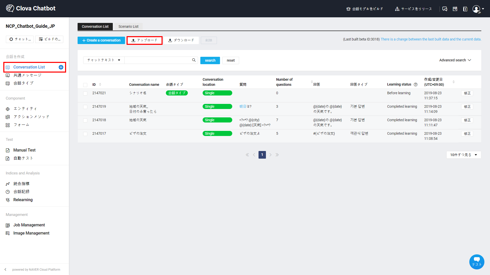
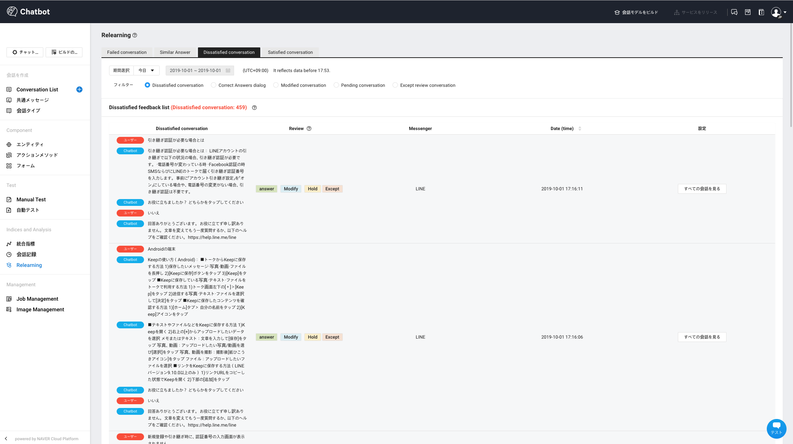

---
search:
  keyword: ['chatbot','チャットボット']
---

## チャットボットのクイックスタートガイド

LINE BRAINのチャットボットサービスは、素早く簡単にチャットボットを作成できるように手伝います。

以下のガイドに沿ってチャットボット作りをスタートする前に["チャットボットを開発する前に考えることのガイド"](chatbot-1-2_ja.md)をぜひ確認してください。

### チャットボットサービスを作成する

コンソールに接続し、以下のステップを経てチャットボットサービスを簡単に作ることができます。

* Step 1. サービスの利用申し込みおよび規約への同意
* Step 2. 会話の作成
* Step 3. 学習およびテスト
* Step 4. チャンネルを連動
* Step 5. Agent Connections
* Step 6. Relearning

#### Step 1. サービスの利用申し込みおよび規約への同意

チャットボットサービスを利用するためには、利用の申し込みおよび規約への同意が必要です。

本サービスの利用規約は、チャットボットから発生するデータの保存および使用に関する内容と個人情報の委受託、会社の義務および顧客の義務に関する内容が盛り込まれています。サービスを企画する前に規約の内容を必ず確認してください。

<!--[チャットボットの利用規約へ](https://www.ncloud.com/policy/chtbt)-->

#### Step 2. 会話の作成

チャットボットビルダーは、チャットボットの会話データを入力してテストするWebコンソールで、チャットボット開発に必要なさまざまな機能を提供しています。

① 左側のメニューの**Conversation List** メニューをクリックします。

② **Create a coversation**をクリックします。

③ **シナリオ名**を入力します。

- シナリオ名は、他の会話と重複しない固有の名前を入力します。シナリオ名を入力してから「OK」ボタンをクリックすると、会話の作成が終わります。

- シナリオ名は、Similar Answerまたは固定メニューを設定した場合、該当のシナリオ名がユーザーにそのまま露出されます。そのため、シナリオ名は今作成している会話の内容を代表できるように注意を払って書きます。例えば、営業時間を確認する会話を作成する場合、会話のタイトルを「営業時間の確認」のように入力できます。

④ **会話タイプ**を入力します。

* 会話タイプは、多くのConversation Listを簡単に管理するための機能です。オプションの入力値なので、入力が必須ではないですが、運用にあたり該当会話が持っている属性を把握して会話タイプを入力することをお勧めします。
* 例えば、「会員登録の問い合わせ」という会話の会話タイプは、「問い合わせ」「会員登録」などで入力できます。

⑤ 質問を登録します。

* 質問の数は多ければ多いほど良いです。しかし、文の語尾だけを拡張して質問の数を増やすよりは、さまざまな発話のタイプを入力したほうがより学習に役立ちます。

* 例えば、ユーザーが特定商品の料金が知りたい場合、どのように聞くかについて考えることができます。
  - XX商品いくら？
  - いくらでXX商品買えるの？
  - XX商品高い？
  - XX商品の価格は？
  - 料金表あったら教えて
  - XX商品の見積もりくれない？
  - XX商品の社員割引の価格を教えて

  上記の例のように多様な発話タイプを入力すると、モデルがより多くのユーザーの発話を理解するに役立ちます。

* もし該当の会話に質問を入力しなければ、該当の会話は未完成の会話でモデル学習の対象から除外され、失敗メッセージが返されることがあります。また、それぞれ違う会話に同じ質問を登録すると、モデル学習の邪魔になることがありますので注意して入力してください。

* 質問を入力する際に、一般質問と正規表現質問の中から1つの質問タイプを選択することができます。

  - 一般質問は、自然言語で入力された質問のことで、モデルの学習データとして活用されます。
  - さまざまな表現の文を圧縮的に表現する必要があれば、正規表現質問を活用します。ただし、正規表現質問はモデルの学習データとしては活用されません。
  - 正規表現の表記法についての詳細は、["正規表現の入力ガイド"](chatbot-3-8_ja.md)を参照してください。

* 「アップロード」または「ダウンロード」ボタンをクリックして、大量の質問をExcelファイルでアップロードできます。

- 質問をアップロードするとき、指定されたアップロードファイルのフォーマットに合わせてください。適してないフォーマットは、アップロードに失敗することがあります。

  - A列：質問タイプ（「General Questions」または「」を選択して入力します。）
  - B列：質問（追加したい質問を入力します。）

  

- もし既に入力されている質問を他の会話に移動させたいのであれば、質問を選択して「Move」ボタンをクリックして他の会話に移動することができます。

⑥ 回答を登録します。

* 回答のタイプを選択：基本回答（テキスト）以外にも、さまざまなタイプの回答を簡単に作成することができます。詳細については["Conversation Listの管理"](chatbot-3-2_ja.md)で扱います。
  - 基本回答
  - 画像回答
  - マルチリンク回答
  - 選択式回答
  - Flex Message回答
  - 連続回答
  - LINEスタンプ回答

- 条件：各回答にANDとORを組み合わせたさまざまな条件を設定することができます。

  - 5つのAND条件と10のOR条件で、最大50の条件設定が可能です。

  - 条件が設定されている回答が、条件が設定されていない回答より優先に応答されます。また、条件が満たされる回答がない場合には、失敗の発話が応答されることがありますので注意してください。

  - 時間条件：特定の時間帯にのみ応答する回答を設定できます。
  - 曜日条件：特定の曜日にのみ応答する回答を設定できます。複数の曜日を選択できます。
  - 日付条件：特定の日のみ応答する回答を設定できます。
  - エンティティ条件：特定のエンティティをユーザーが発話する、または発話しない場合のみ応答する回答を設定できます。
  - フォーム条件：特定の選択式フォームに対してユーザーが選択したボタンを覚えて、特定のボタンを選択する、または選択しないユーザーにのみ応答する回答を設定できます。
  - カスタム条件：自らカスタムした条件を回答に設定できます。　条件を検証するAPI URLを入力してください。
  - 複数の条件が追加された場合、すべての条件が満たされる場合のみ回答が応答されます。
  - 2つ以上の回答に設定された条件が同時に満たされる場合、ランダムで応答されます。 
    例：回答1に［火曜日］の条件を設定し、回答2に［12/25］と日付条件を設定した場合
    仮に12月25日が火曜日であれば、2つの回答がすべての条件を満たしているため、回答1と回答2がランダムで応答されます。

- メッセンジャーを設定：特定のメッセンジャーでのみ応答する回答を設定できます。仮に「All messengers」の回答と特定メッセンジャーに設定した回答が、同時にサービスONになっている場合、該当のメッセンジャーでは「All messengers」に設定した回答は応答されません。
  - 特定のメッセンジャーで対応しない回答タイプを選択した場合、ユーザーには失敗のメッセージが応答されることがあります。
  - メッセンジャーの条件をClovaに設定する場合、「基本回答」タイプのみ対応します。そして、「All messengers」で設定した回答をClovaと連動する場合、各回答タイプの「テキスト回答」のみ音声で提供されます。

- サービスON/OFFの設定：回答のサービス状態をON/OFFで設定できます。複数の回答をサービスONに設定する場合、該当する回答がランダムに応答されます。例えば、特定の質問に対して2つ以上の回答がONになっている場合、 質問が入ると、回答が登録された順番とは関係なくランダムに応答が出ます。仮に、ユーザーが約5時間内に同じ質問を追加で投げかける場合、まだ露出されていない回答の中から応答が出ます。

- プレビュー：作成した回答のプレビューを確認できます。編集した内容がリアルタイムでプレビュー画面に反映されます。

- 回答：チャットボットが回答する文を作成します。
  - **回答** 入力欄に`$`や`#`を入力すると、アクションメソッドやフォームを素早く入力できます。
  - フォーム入力は、基本回答と選択式回答タイプでのみ可能で、画像回答やマルチリンク回答など、形式が指定されたテンプレートの回答の場合にはフォーム入力ができません。詳細については["会話コンポーネントの管理"](chatbot-3-3_ja.md)で扱います。
  - メッセージがLINEに設定されている場合、**回答** 入力欄で ``{0x000000}` 形式でLINEの絵文字を追加できます。入力できるLINE絵文字は["LINE Original emoji "](<https://developers.line.biz/media/messaging-api/emoji-list.pdf>)から確認できます。

- URLの追加

  * URLアドレス：リンクするURLアドレスを入力してください。

- もし、該当する会話で入力された回答がなければ、該当の会話は未完成の会話でモデル学習の対象から除外され、失敗メッセージが返されることがあるので注意してください。

⑦ Excelを利用して会話を作成し、チャットボットに一括アップロードすることもできます。アップロードのタイプは、JSONアップロードと一般アップロードがあります。

- Conversation Listで「アップロード」をクリックし、Excelファイルをアップロードします。

- 指定されたアップロードファイルのフォーマットに合わせてください。適してないフォーマットでアップロードすると、会話の作成に失敗することがあります。

- 一般会話の基本回答、画像回答、マルチリンク回答、選択式回答など一部の回答タイプのみ、Excelのアップロード/ダウンロードに対応します。スロット会話は、Excelのアップロード/ダウンロードをサポートしません。

- Excelのアップロードにより、新しい会話の新規作成だけでなく、既存の会話に質問または回答を追加できます。

  - A列：Conversation name（既存のConversation nameと重複しない名前を入力すると、新しい会話が生成されます。重複した名前を入力した場合、既存の会話に質問または回答が追加されます。）

  - B列：会話タイプ（複数の会話タイプを選択する場合「|」記号を使って区別します。）

  - C列：Conversation location（シナリオ上のConversation locationを入力します。Start、Intermediate、Last、Singleの中から選択します。）

  - D列：質問タイプ(一般の質問と正規表現質問の中から選択します。）

  - E列：質問(複数の質問を入力する必要がある場合、下に行を追加して入力します。）

  - F列：メッセンジャー条件（All messengers、LINE、LINE WORKS、カカオトーク、NAVER TalkTalk、Facebook、Custom、Clovaの中から選択して入力します。）

  - G列：条件（該当する回答を応答する条件を選択します。）

      - 条件なし：条件の列を空欄にしておきます。
      - 複数条件：（条件1OR条件2）AND（条件3の形式で入力します。全ての条件は括弧で囲んで入力する必要があります。
      - 時間条件：24時間表記法で入力します。
      - 曜日条件：「月～日」の中から選択して入力します。
      - 日付条件：「月/日~月/日」フォーマットで入力します。
      - エンティティ条件：@エンティティ名 = 代表語または@エンティティ名 ≠ 代表語の形式で入力します。
      - フォーム条件：#{フォーム名} = ボタン名または #{フォーム名} ≠ ボタン名の形式で入力します。
    - カスタム条件：endpointを入力します。

- H列：回答のタイプ（作成する回答のタイプを指定します。基本回答、マルチリンク、画像、選択式回答の中から1つのみ選択できます。それ以外の回答タイプは、アップロード/ダウンロードに対応しません。）

- I列：回答（複数の回答を入力する必要がある場合、下に行を追加して入力します。選択入力の値は、入力しなくてもいいです。）

  - 基本回答

    回答：回答メッセージを入力します。改行が必要であれば「\n」記号を入力します。

    URL：URLアドレスを入力します。

  - マルチリンク

    回答：回答メッセージを入力します。

    ボタン1：URLアドレスを入力します。

  - 画像回答

    [画像カード]
    画像回答タイプ：画像回答のタイプを選択します。「画像」または「画像＋テキスト」の中から1つを選択して入力します。
    タイトル：画像のタイトルを入力します。
    画像の説明：画像を説明する回答を入力します。
    ボタン1：ボタン名を入力します。（URLアドレスを入力します。)

- 選択式回答

  回答：#{選択式フォーム名}の形式で入力します。

- J列：サービス状況（該当する回答のサービス状況をON/OFFで入力します。）

#### Step 3. 学習およびテスト

チャットボットが完成したら、チャットボットのエンジンがきちんと動作するかを確認する過程が必要です。

LINE BRAINのチャットボットは、会話モデルをビルドします。

① 会話モデルをビルド

チャットボットのビルダー上部の**会話モデルをビルド**をクリックします。

もしビルドの変更点を記録する必要があれば、ビルドメモを作成することができます。

チャットボットのエンジンは会話のデータセットに基づいて学習を進めます。

- 自然言語分析の基本であるNLP（Natural Language Processing）は、質問データと回答データに入力された文の形態素を分析します。その次のステップであるNLU（Natural Language Understanding）では、文がどのような意味を持っているか、どの回答に最も類似しているかを判断します。また学習では、データ辞書にマッピングして一般的なエンティティマッピング作業を進めます。特定のドメインで学習が必要なエンティティのみタグ付けした場合、そのタグ付けの内容を含めてエンジンで学習させます。
- 学習は、データサイズによって数分から数時間かかることがあります。
  LINE BRAINでは、学習処理の高速化のためにGPUを活用します。1つのモデルで学習させるのではなく、チャットボットエンジンではさまざまなレベルの学習モデルを提供します。例えば、学習の実行を開始してから、テストメニューでは現在のビルドをリクエストしたモデルの回答が出るかどうかをテストすることができます。学習がすべて完了すると、さまざまな発話のタイプをカバーすることができます。
- 学習時間は、データの量によりますが、会話データセットが100以下の場合は5分～10分の間で学習が完了します。そして、会話を1つ登録してから学習を行った場合、あまりにもデータセットが小さくて学習に失敗してしまいます。少なくとも10以上の会話データセットを入力し、テストを行う必要があります。

②変更された修正の適用

チャットボットビルダー上部の**会話モデルをビルド**でApply changed settingsボタンをクリックします。

モデル学習が必要ない機能をすぐサービスに適用できます。変更された設定は、直近にビルドされたモデルでのみサポートできます。なお、設定の適用が終わると、自動でベータがリリースされます。

ビルドなしに「Apply changed settings」で反映できる機能は下記のとおりです。

- 共通のメッセージの修正
  - キーワードの管理（新規登録、回答の追加および修正）
  - 失敗メッセージ（追加、修正、削除）
  - 固定メニュー（サービスの使用有無）
  - フィードバック（サービスの使用有無は、フィードバック文面の修正および応答メッセージのテキストの修正や削除）
  - Similar Answerの文面の修正（サービスの使用有無は、モデルのビルドが必要です。）
- フォームの修正および追加（ただし、新規会話にフォームの登録と他の会話との連動は修正リリース対象ではありません。）
  - ボタンの追加、削除、位置の変更
  - ボタンアクションのテキストを修正
  - クイックリプライ機能に変更
- Agent Connectionsサービスの有無
- アクションメソッド設定の修正
- エンティティ学習

③ ビルドをキャンセル

モデルのビルドを開始した後、data_snapshotの直前にビルドをキャンセルすることができます。

④ ビルド管理

チャットボットを作成するまで、時間をかけて回答の精度を高めます。この過程でモデルを学習させるヒストリーの管理が必要です。

- [ビルド管理]項目に移動したら、ビルドについて追加情報を見ることができます。

現在ビルドされている項目とビルド現状が提供されます。以前に学習させたモデルに戻ってサービスをリリースするなど、リリース管理機能が提供されます。詳細については、["ドメイン管理"](chatbot-3-1_ja.md)で扱います。

⑤ テスト

ビルドが完了したら、作成されたデータをテストできます。テストの種類には1件ずつ直接手動で質問を入力する「Manual Test」とExcelファイルをアップロードして自動でテストを行う「自動テスト」があります。また、自動テストの高級機能としては、ベータバージョンが変更されるたびに自動でテストを行い、データ品質をチェックできる「Quality Test」があります。

- Manual Test：テスト環境を選択し、学習した会話をテストできる機能を提供します。その上、メッセンジャーや日付/時間条件を指定し、会話をテストできます。

  - Learn moreでは、分析されたConversation name、会話タイプ、エンティティ、正規表現とキーワードを確認できます。修正ボタンをクリックし、分析された会話の修正ページに移動します。

- 自動テストにより、決まったフォーマットの質問リストをアップロードして抽出される回答をまとめて確認することもできます。

- メッセンジャーや日付/時間条件を指定して会話をテストできます。テストが完了したら、タスクマネージャーからダウンロードできます。

- アップロードのフォーマット
  - **テスト用のテンプレートのダウンロード**をクリックしてテンプレートファイルを確認できます。
  - xlsおよびxlsx形式のファイルのみ対応します。

- Quality Testにより、チャットボットのバージョンごとに品質をチェックすることができます。

- 最新のベータバージョンが変更されるたびに品質評価を自動で行います。
- 該当ドメインで主に管理が必要な質問と、それにマッチされるべきConversation nameを品質評価データとして登録します。評価が完了したらPASS率を確認でき、タスクマネージャーページから詳細をダウンロードできます。
- メッセンジャーや日付/時間条件を指定して会話をテストできます。もし設定を解除したいなら、「選択なし」に設定します。
- アップロードのフォーマット
  - **Quality Test用のテンプレートのダウンロード**をクリックしてテンプレートファイルを確認できます。
  - xlsおよびxlsx形式のファイルのみ対応します。

#### Step 4. チャンネルを連動

チャットボットの会話データを作成したら、実際にサービスするチャンネル連動を設定する必要があります。
各ドメインごとに使用量を提供し、外部に安全にサービスを提供する必要があるため、**API Gateway** と連動して提供されます。

① メッセンジャーチャンネルを連動する

- メッセンジャーチャンネル：LINE、LINE WORKS、Custom（Webチャット）など様々なルートで入ってくる発話を処理し、メッセンジャープラットフォームとの連動を提供できます。現在提供しているメッセンジャープラットフォームは、LINE、LINE WORKS、Custom（Webチャット）で、今後より多くのメッセンジャーに拡大していく予定です。
  * [LINE連動ガイドへ](chatbot-2-1_ja.md)
  * [LINE WORKS連動ガイドへ](chatbot-2-6_ja.md)

② 会話記録を確認する

- メッセンジャーやカスタムチャンネルと連動してサービスを実行した後、ユーザーとチャットボットの会話記録を確認できます。
- 会話記録では、Conversation name、会話タイプ、回答、メッセンジャーを検索できます。
- チャットボットがきちんと応答できなかった質問を確認できます。
- [すべての会話を見る] ボタンをクリックしたら、該当の会話セッションでユーザーとチャットボットが交わしたすべての会話やそれぞれの会話/回答タイプを確認できます。

#### Step 5. Agent Connections

チャットボットが処理しきれないユーザーからの要望は、Agent Connectionsで解決できます。

- オペレーターに引き継ぐためには、LINE Switcher API連動を設定してからオペレーターに引き継ぐための会話を作成する必要があります。
  - [Agent Connectionsガイドへ](chatbot-2-7_ja.md)

#### Step 6. Relearning

チャットボットサービスを開始してからは、ユーザーの会話記録を基にエンドユーザーがチャットボットとどのような会話をしたか把握する必要があります。回答の精度を高めるために、チャットボットが回答できなかったユーザーの質問を会話に反映する必要があります。このようなプロセスをRelearningと言います。

① Failed conversationのRelearning

ユーザーの質問にFailed conversationとして応答されたConversation Listを確認・検討することができます。

- 修正ボタンをクリックすると、該当質問を既存に作成されている会話に追加できます。Conversation nameや質問で検索し、適切な会話で追加できます。
- 保留ボタンをクリックすると、後ほど見直しができます。
- 除外ボタンをクリックすると、検討の対象ではない会話をFailed Conversation Listから除くことができます。

② Similar AnswerのRelearning

ユーザーの質問にSimilar Answerとして応答されたConversation Listを確認・検討することができます。

- 修正ボタンをクリックすると、該当質問を既存に作成されている会話に追加できます。
- 保留ボタンをクリックすると、後ほど見直しができます。
- 除外ボタンをクリックすると、検討の対象ではない会話をSimilar Answer Listから除くことができます。

③ Dissatisfied conversationのRelearning

ユーザーがチャットボットの回答に対し、Dissatisfiedのフィードバックを送ったConversation Listを確認・検討することができます。

- 正解ボタンをクリックすると、チャットボットの回答が適切だと判断され、Dissatisfied Conversation Listから除外されます。
- 修正ボタンをクリックすると、該当質問を既存に作成されている会話に追加できます。
- 保留ボタンをクリックすると、後ほど見直しができます。
- 除外ボタンをクリックすると、検討の対象ではない会話をDissatisfied Conversation Listから除くことができます。

④ Satisfied conversationのRelearning

ユーザーがチャットボットの回答に対し、Satisfiedのフィードバックを送ったConversation Listを確認・検討することができます。

- 正解ボタンをクリックすると、チャットボットの回答が適切だと判断され、Satisfied conversation Listから除外されます。
- 修正ボタンをクリックすると、該当質問を既存に作成されている会話に追加できます。
- 保留ボタンをクリックすると、後ほど見直しができます。
- 除外ボタンをクリックすると、検討の対象ではない会話をSatisfied conversation Listから除くことができます。

<!---

#### [Tip]サービスDemo Excelのテンプレート

チャットボットのDemo会話セットをインポートしてテストしてみることができます。

 [Excel Templateのダウンロード](../../download/chatbot-demo-sample.zip)

  zipファイルには、5つのExcelテンプレートファイルがあります。（順番でアップロードすることを推奨）

  1. 会話タイプ
  2. エンティティ
  3. アクションメソッド
  4. フォーム
  5. 会話-韓国語

- 会話に登録されている回答にFormやActionMehtodを参照する場合、アップロード中にエラーが発生することがあります。
  そのため、会話タイプとエンティティなど上記でお勧めする順番でファイルをアップロードします。

- 5つのテンプレートをアプロードした後、会話モデルをビルドをクリックします。

- テストで、会話に登録されている質問を入力してテストします。
-->

## 関連情報へのリンク

ドメインの作成、Conversation Listとコンポーネントの管理および統計管理に関しては以下の利用ガイドを参照してください。

- 1.LINE BRAIN CHATBOTスタートガイド
  - [チャットボットサービスを始める前に考慮すべきこと](./manual/chatbot-1-2_ja.md)
  - [Quick Start Guide](./manual/chatbot-1-1_ja.md)
  - [よくある質問](./manual/chatbot-1-3_ja.md)
- 2.LINE BRAIN CHATBOT利用ガイド
  - [ドメイン](./manual/chatbot-3-1_ja.md)
  - [Conversation Listの管理](./manual/chatbot-3-2_ja.md)
  - [会話コンポーネント](./manual/chatbot-3-3_ja.md)
  - [統計管理](./manual/chatbot-3-4_ja.md)
  - [チャットボットのAdvancedガイド](./manual/chatbot-3-5_ja.md)
  - [正規表現の入力ガイド](./manual/chatbot-3-8_ja.md)
  - [チャットボットのCustom API Spec.](./manual/chatbot-3-7_ja.md)
- 3.チャンネル連動ガイド
  - [チャンネル連動ガイド - LINE](./manual/chatbot-2-1_ja.md)
- 4.有人チャットツール連動ガイド
  - [Agent Connectionsガイド - LINE(LINE Switcher API)](./manual/chatbot-2-7_ja.md)
- 5.拡張サービス連動ガイド
  - [LINE PAYサービス連動ガイド](./manual/chatbot-2-8_ja.md)
