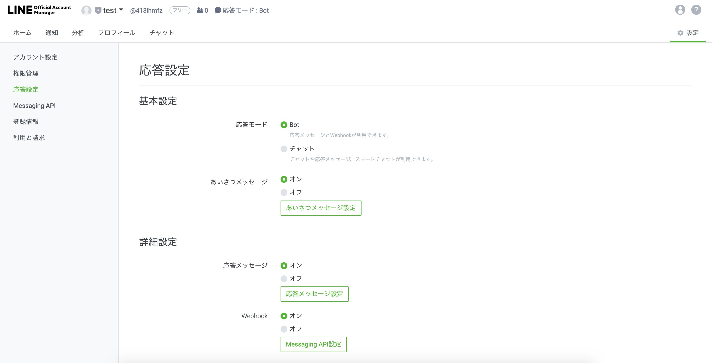
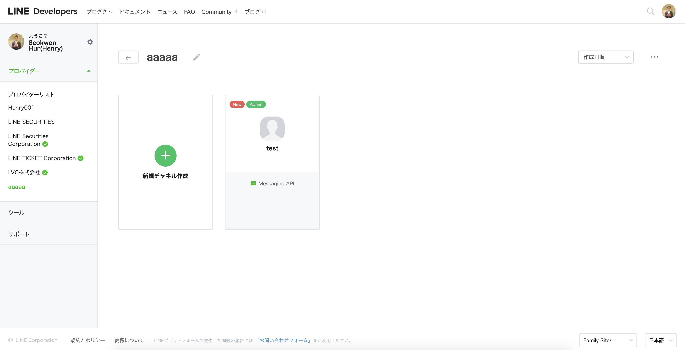
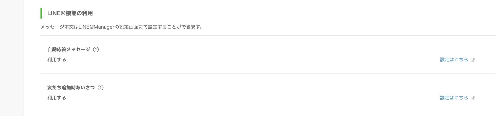
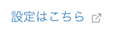

---
search:
  keyword: ['chatbot','チャットボット','LINE連動']
---

## チャンネル連動ガイド - LINE

チャットボットが完成されてから、チャットボットをサービスするチャンネルとの連動を設定する必要があります。

<!--
各ドメインごとに使用量を提供し、外部に安全にサービスを提供する必要があるため、NAVERクラウドプラットフォームの **API Gateway** 商品と連動して提供されます。
そのためには、事前にNAVERビジネスプラットフォームのAPI Gateway商品の利用を申し込んだ後、規約に同意する必要があります。使用量によってAPI Gateway料金が課金されます（API Gatewayは、1,000,000件のAPI呼び出しが無料で提供されます）。

アカウントの連動を開始する前、API Gatewayに呼び出しURL（Invoke URL）が生成されている必要があります。

* [Custom API - 呼び出しURLの作成ガイドへ](chatbot-2-5.html)
-->
## LINE公式アカウントをはじめる

簡単な設定で、LINE BRAINのチャットボットとLINEを連動することができます。

LINEのチャンネル連動を設定するためには、LINE公式アカウントが必要です。すでにLINE公式アカウントがあれば、[LINEを連動する](#line-を連動する)ステップに移動します。

① [LINE Business Center](https://entry-at.line.me/)に接続してアカウントを作成します。

② アカウント情報を入力した後 **続行**をクリックします。

③ 入力したアカウント情報を確認した後 **提出**をクリックします。

④ アカウントの申請が完了したら LINE@ Managerにログインします。

## LINEを連動する

① [LINE Business Center](https://at.line.me/ko/)に接続し、 **管理画面**をクリックします。

② LINE@ Managerに遷移し、**アカウント設定**をクリックします。

③ **Messaging API設定 > APIをONにする**をクリックします。

④ **LINE Developers**をクリックします。

### LINE Developersの設定

**LINE Developers**でWeb Hook URL、Channel Tokenの情報を確認および修正できます。

#### チャンネルの設定

① Basic information: 基本情報を確認および修正します。

② App name: アプリ名を確認および修正します。

③ App description: アプリの説明を確認および修正します。

④ Channel ID: 生成されたチャンネルの固有識別IDです。

* **Channel IDはコピーして記録しておきます。**

⑤ Channel Secret: **Issue**をクリックし、新しいChannel Secretを取得します。

* 新しいChannel Secretを取得する場合、既存のSecretを取得した後、最低1時間経過してから取得してください。
* Channel Secretはコピーして記録しておきます。

#### メッセージの設定

① Messaging settings: メッセージングに関する情報を確認および修正します。

② Channel access token: **Issue**をクリックし、新しいChannel access tokenを取得します。

* Channel access tokenは、いつでも必要なときに新しく取得できます。
* **Channel access tokenはコピーして記録しておきます。**

③ Use webhooks: Webhookの設定状態です。

* **Enabled（有効）**に設定した後、**Update**をクリックします。

④ Webhook URL: Webhook URLを設定します。

* URLを入力し、**Update**をクリックした後、**Verify**をクリックします。
* **Webhook URLは、チャットボットビルダーで取得したInvoke URLの値を入力します。**

⑤ Allow bot to join group chats: グループチャットを設定します。

#### LINE@の設定

① Using LINE@ features: LINE@利用に関する詳細設定を変更できます。

② Auto-reply messages: 自動応答メッセージを設定します。

*  ボタンをクリックし、状態を修正できます。
* **Set massage**をクリックし、ユーザーの会話に自動応答メッセージの内容を修正できます。

③ Greeting messages: 最初の挨拶メッセージを設定します。

* ボタンをクリックして状態を修正できます。
* **Set massage**をクリックして最初の挨拶メッセージの内容を修正できます。

## LINE BRAINのチャットボットを設定する

LINEの設定で覚えておくべき値は以下のとおりです。

- Channel ID
- Channel Secret
- Channel access token

チャットボットサービスの**チャンネルを連動**から**LINE**を選択し、上記の3つの値を入力します。

## 関連情報へのリンク

ドメインの作成、Conversation Listとコンポーネントの管理および統計管理に関しては以下の利用ガイドを参照してください。

- Chatbotスタートガイド
  - [チャットボットを開発する前に考えること](chatbot-1-2_ja.md)
  - [チャットボットのクイックスタートガイド](chatbot-1-1_ja.md)
  - [チャットボットのよくある質問](chatbot-1-3_ja.md)    
- Chatbotご利用ガイド
  - [ドメイン管理](chatbot-3-1_ja.md)
　- [Conversation Listの管理](chatbot-3-2_ja.md)  
  - [会話コンポーネントの管理](chatbot-3-3_ja.md)
  - [統計の管理](chatbot-3-4_ja.md)
  - [チャットボットのAdvancedガイド](chatbot-3-5_ja.md)
  - [正規表現の入力ガイド](chatbot-3-8_ja.md)
  - [チャットボットのCustom API Spec.](chatbot-3-7_ja.md)
- チャンネル連動ガイド
  - [LINE連動](chatbot-2-1_ja.md)
- Agent Connectionsガイド
  - [LINE Switcher API連動](chatbot-2-7_ja.md)