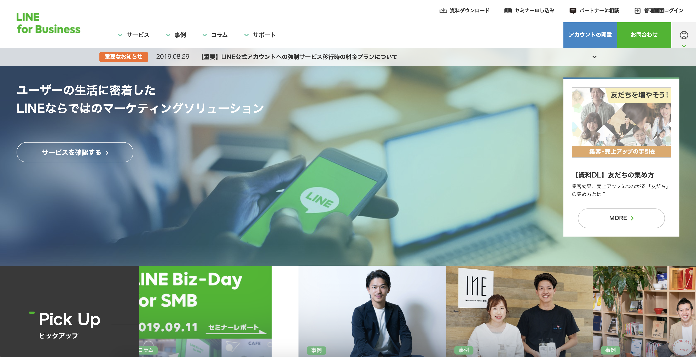
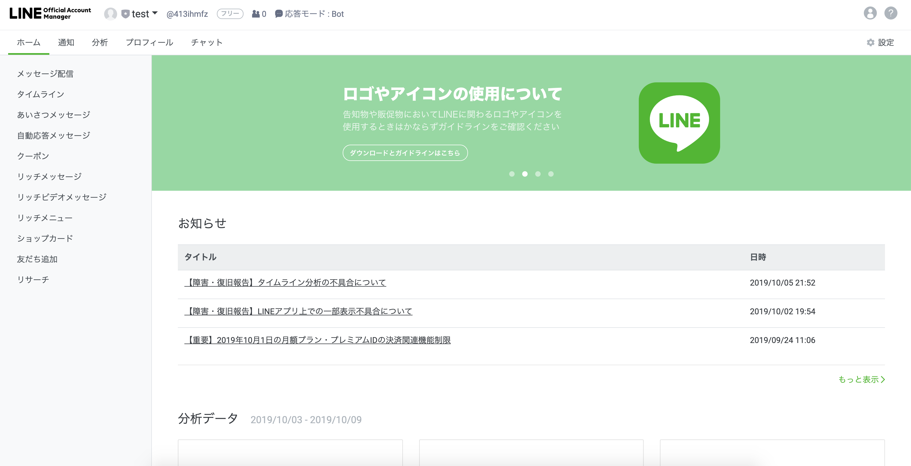
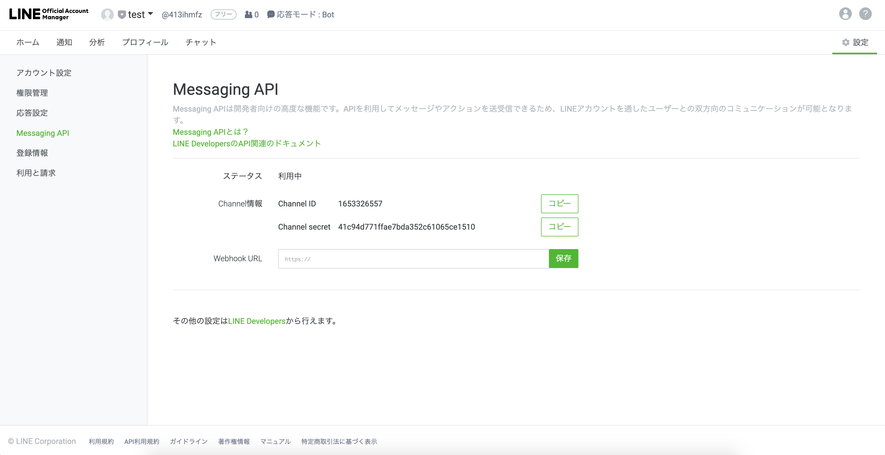

---
search:
  keyword: ['chatbot','チャットボット','Agent Connections']
---

## Agent Connectionsガイド - LINE(LINE Switcher API)

Agentに引き継ぐためには、LINE Switcher API連動を設定してからAgent Connectionsのための会話を作成する必要があります。

<!--
各ドメインごとに使用量を提供し、外部に安全にサービスを提供する必要があるため、NAVERクラウドプラットフォームの **API Gateway** 商品と連動して提供されます。
そのためには、事前にNAVERビジネスプラットフォームのAPI Gateway商品の利用を申し込んだ後、規約に同意する必要があります。使用量によってAPI Gateway料金が課金されます（API Gatewayは、1,000,000件のAPI呼び出しが無料で提供されます）。

アカウントの連動を開始する前、API Gatewayに呼び出しURL（Invoke URL）が生成されている必要があります。

- [Custom API - 呼び出しURLの作成ガイドへ](chatbot-2-5.html)
-->

## LINE Switcher APIを連動する

① [LINE Business Center](https://at.line.me/ko/)に接続し、 **管理画面**をクリックします。

② LINE OA Managerに遷移し、**アカウントの設定**をクリックします。

③ **Messaging APIの設定 > APIをONにする**をクリックします。

④ **LINE Developers**をクリックします。

### LINE Developers情報を確認する

**LINE Developers**のSwitcher API Settings TabからSwitcher secret、Destination ID情報を確認できます。

① Switcher API Settings Tabをクリックします。

② Switcher Secret、Destination ID情報をコピーして記録しておきます。

## LINE BRAINのチャットボットを設定する

#### Agent Connectionsを設定する

LINEの設定で記憶しておくべき値は、次のとおりです。

- Switcher secret
- Destination ID

チャットボットサービスの **Agent Connections**で**LINE**を選択し、上記の２つの値を入力します。

- agentに引き継ぐことが失敗した場合、応答するメッセージも一緒に入力します。

#### Agentに引き継ぐ会話の作成

LINE Switcher API連動が完了すると、Agentに引き継ぐためのアクションメソッド `${'lineSwitcherApi}`が表示されます。

Agentに引き継いでもらいたい会話の回答にアクションメソッド `${'lineSwitcherApi}`を入力し、Agent Connectionsの設定を完了します。

## 関連情報へのリンク

ドメインの作成、Conversation Listとコンポーネントの管理および統計管理に関しては以下の利用ガイドを参照してください。

- Chatbotスタートガイド
  - [チャットボットを開発する前に考えること](chatbot-1-2_ja.md)
  - [チャットボットのクイックスタートガイド](chatbot-1-1_ja.md)
  - [チャットボットのよくある質問](chatbot-1-3_ja.md)    
- Chatbotご利用ガイド
  - [ドメイン管理](chatbot-3-1_ja.md)
　- [Conversation Listの管理](chatbot-3-2_ja.md)  
  - [会話コンポーネントの管理](chatbot-3-3_ja.md)
  - [統計の管理](chatbot-3-4_ja.md)
  - [チャットボットのAdvancedガイド](chatbot-3-5_ja.md)
  - [正規表現の入力ガイド](chatbot-3-8_ja.md)
  - [チャットボットのCustom API Spec.](chatbot-3-7_ja.md)
- チャンネル連動ガイド
  - [LINE連動](chatbot-2-1_ja.md)
- Agent Connectionsガイド
  - [LINE Switcher API連動](chatbot-2-7_ja.md)