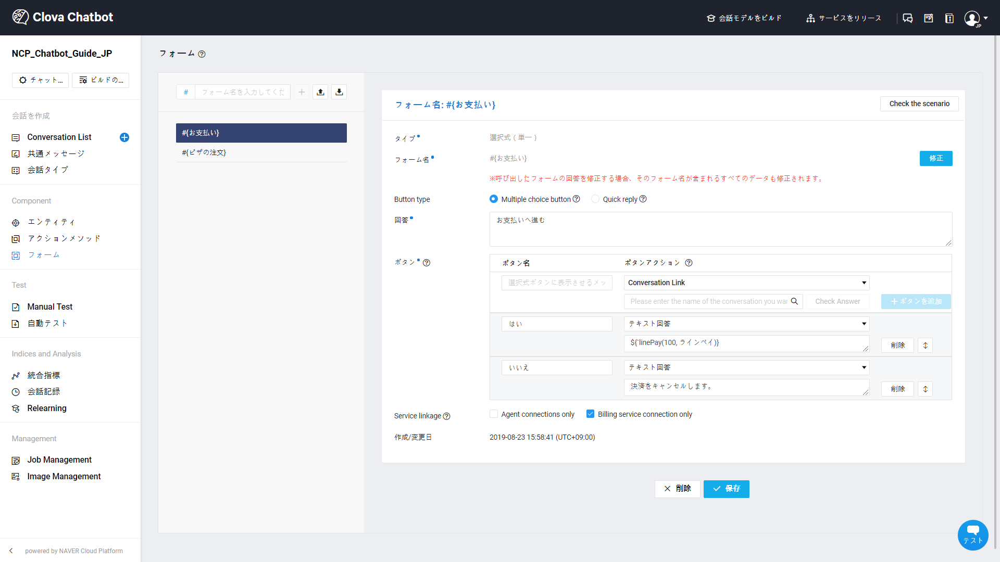

## LINE PAYサービス連動ガイド

LINE PAYサービスを利用するためには、LINEメッセンジャー連動を先に設定する必要があります。

- [LINE連動](chatbot-2-1.md)

## LINE PAY APIを連動する

①[pay.line.me](<https://pay.line.me/jp/center/test/main?locale=en_US>)に接続し、LINE Pay加盟店申請を行います。

② 加盟店申請が完了すると、次のようなLINE PAY IDが生成されます。

- LINE_Pay_ID@line.pay

③ 加盟店センターで該当のIDでログインした後、決済連動管理>連動キー管理からChannel IDとChannel Secret Keyをコピーします。

④ 決済サーバーIPをWhitelist IPに登録します。

## NAVERビジネスプラットフォームでチャットボットを設定する

#### LINE PAY連動の設定

LINE PAYの設定で覚えておくべき値は、以下のとおりです。

- Channel ID
- Channel Secret Key

チャットボットサービスの **サービス連動**から **LINE PAY**を選択し、上記2つの値を入力します。

- 決済完了の結果を送信するURLを入力してください。
- 決済の成功、失敗、拒否の場合に応答するメッセージも一緒に入力します。
  - 決済失敗のメッセージは、LINE Payのアクションメソッドが他のメッセンジャーから呼び出されたときに、連動失敗メッセージで表示されます。

#### LINE PAY連動の会話を作成する

チャットボットサービスで、LINE PAY連動のためのアクションメソッドを設定する必要があります。

- 指定された金額を入力して決済できる「金額入力型」と、連動されているapiの金額を確認して決済する「api連動型」があります。
- 詳細については[会話コンポーネントの管理](chatbot-3-3.md)の **アクションメソッド** 項目を参照してください。

LINE PAYと連動したい会話の回答にアクションメソッドを入力し、決済サービスの設定を完了します。

LINE PAYのアクションメソッドをフォームに登録する際には、「サービス連動> 決済サービス連動専用」を選択してから統合指標で正確な集計結果が確認できます。

## 関連情報へのリンク

ドメインの作成、Conversation Listとコンポーネントの管理および統計管理に関しては以下の利用ガイドを参照してください。

- Chatbotスタートガイド
  - [チャットボットを開発する前に考えること](chatbot-1-2_ja.md)
  - [チャットボットのクイックスタートガイド](chatbot-1-1_ja.md)
  - [チャットボットのよくある質問](chatbot-1-3_ja.md)    
- Chatbotご利用ガイド
  - [ドメイン管理](chatbot-3-1_ja.md)
　- [Conversation Listの管理](chatbot-3-2_ja.md)  
  - [会話コンポーネントの管理](chatbot-3-3_ja.md)
  - [統計の管理](chatbot-3-4_ja.md)
  - [チャットボットのAdvancedガイド](chatbot-3-5_ja.md)
  - [正規表現の入力ガイド](chatbot-3-8_ja.md)
  - [チャットボットのCustom API Spec.](chatbot-3-7_ja.md)
- チャンネル連動ガイド
  - [LINE連動](chatbot-2-1_ja.md)
- Agent Connectionsガイド
  - [LINE Switcher API連動](chatbot-2-7_ja.md)