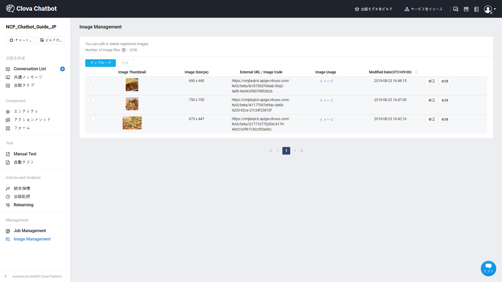
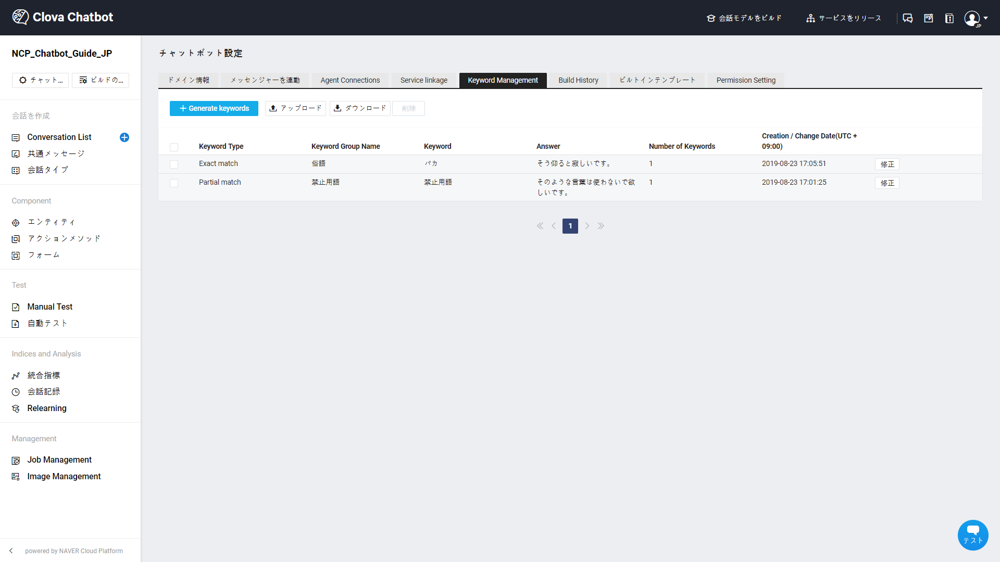
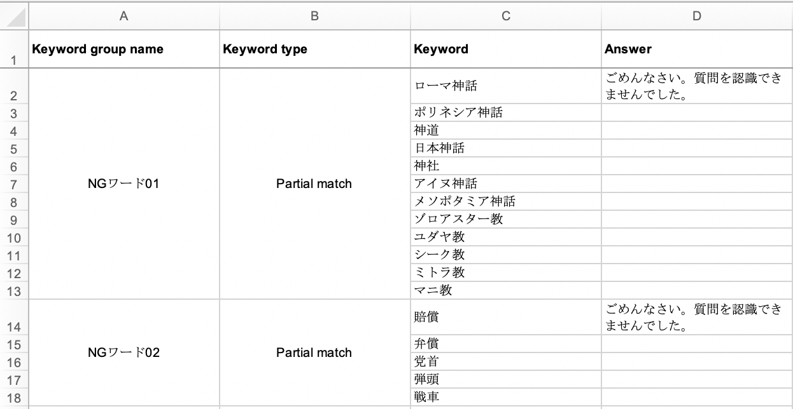
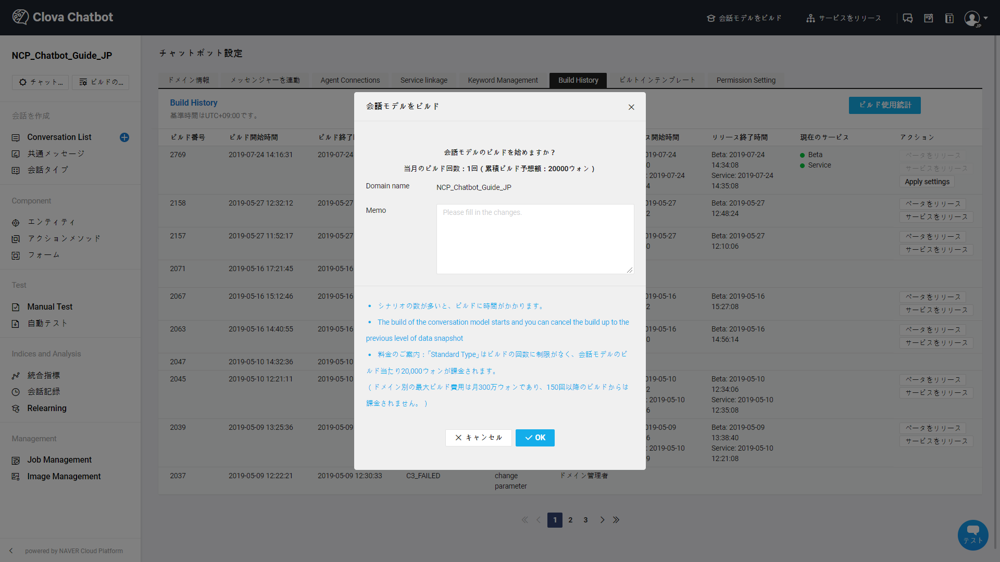
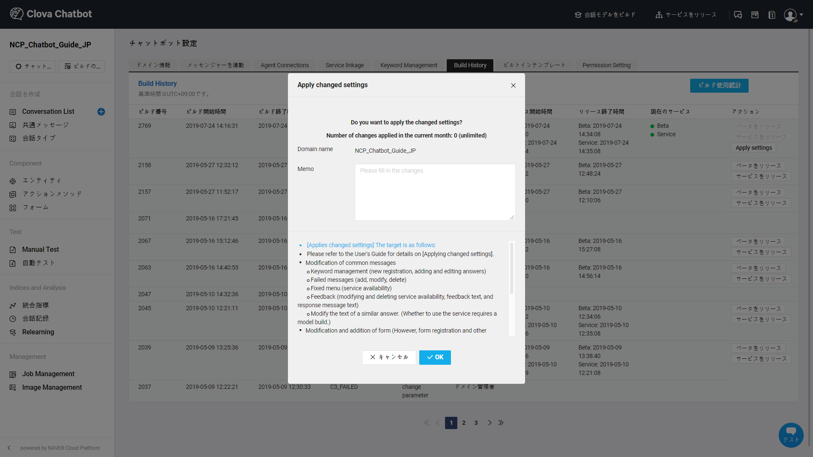
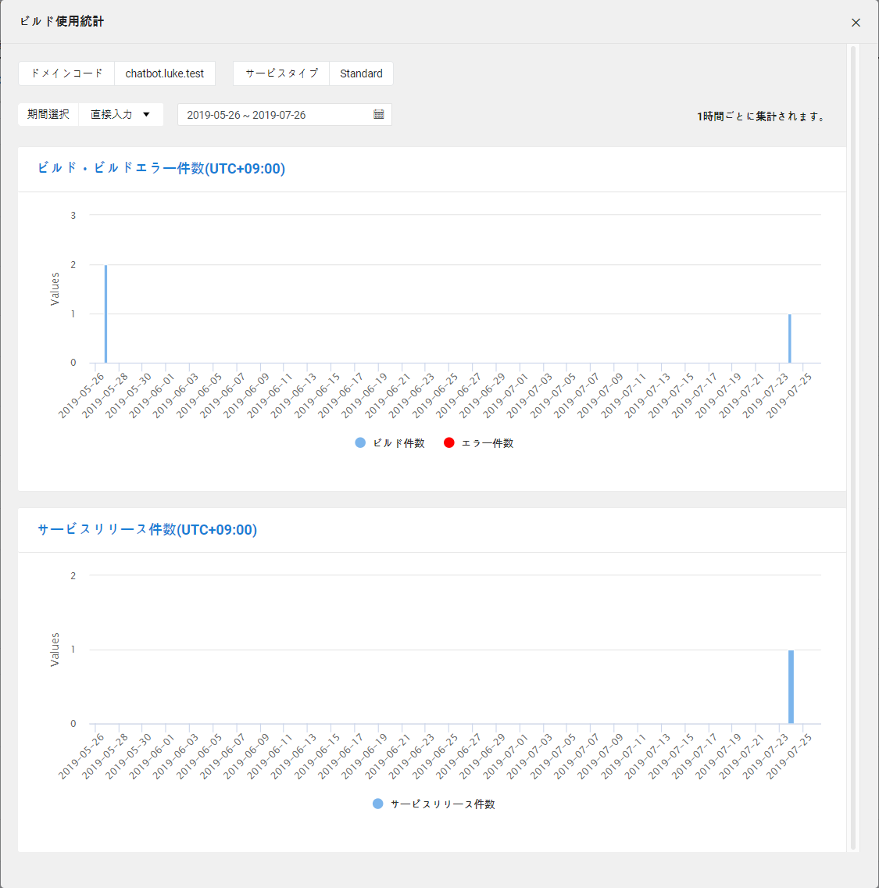
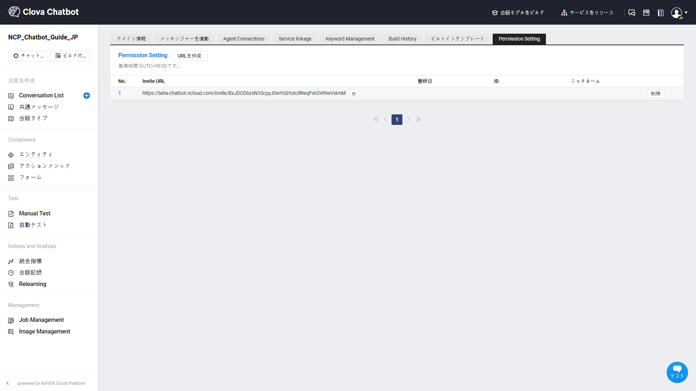

---
search:
  keyword: ['chatbot','チャットボット','ドメイン']
---

## ドメイン

ドメインは、チャットボットサービスの基準になる単位です。
例えば、「LINE BRAINの顧客サポート」を担当するチャットボットを作る場合は、そのチャットボットの全体の会話を含む単位がドメインです。

会話入力およびチャンネル連動、そして統計情報まで1つのドメインを基準に動作し管理されます。

ドメインを作成する際には、ドメイン名とドメインコード、そして自然言語処理の言語が必要となります。

必要な情報が揃えましたらLINE BRAINのCHATBOT担当者までご連絡お願い致します。

- ドメイン名：1文字以上100文字以下で入力できます。
- ドメインコード：固有の値で重複してはならないです。
  ネームスペース形式（com.linebrain.chatbot.support）で入力することをお勧めします。
- 自然言語処理：日本語/英語/韓国語/中国語/タイ語/インドネシア語の中から選択します。

チャットボットサービスは多言語に対応しており、言語ごとに異なる自然言語処理エンジンを持っています。また、各言語の学習のためにさまざまなモデルで学習をさせています。自然言語処理のオプションを選択し、会話入力データを該当言語に合わせて入力する必要があります。

### ドメイン情報

ドメインに関する情報および設定を管理し、現在の状態を確認することができます。

① 基本的なドメイン情報を提供します。

- ドメインID、ドメインコード、ドメイン名、ドメイン作成日および最終修正日

② 登録されているConversation Listの情報を提供します。

- 登録されている会話は、ドメインに作成された会話セットの数です。
- 含まれている会話タイプは、ドメインに含まれている全ての会話タイプの数を言います。
- 含まれているエンティティは、ドメインに作成されたすべての エンティティの数を言います。
- 含まれているタスクは、ドメインに作成されたすべてのタスクの数を言います。

### Job Management

ドメイン内の作業状況を確認できます。Job Managementは、Chatbotビルダーからアクセス可能です。

Chatbot ビルダーのJob Management

- チャットボット設定の **Job Management** タブまたはLNBの **Job Management** 項目から確認できます。
- 該当ドメイン行われたドメインコピーおよび会話アップロード/ダウンロード、自動テスト、プッシュ発送などの作業を確認できます。
- 作業が完了されたファイルをダウンロードでき、作業途中で作業キャンセルも可能です。会話アップロードに失敗した場合、失敗の詳細についても確認できます。

### Image Management

ドメインの中で使われる画像を管理することができます。

- Image Managementページからは、画像を登録、修正、削除できます。

  - 外部のURLは、画像の登録数に集計されず、最大50枚の画像を登録できます。
  - 画像回答や共通メッセージを作成する際に、Image Managementページに登録されている画像を使用できます。
  - Image Usageをクリックすると、該当の画像が使われた回答やメッセージに遷移して該当の画像を修正できます。

### Keyword Management

チャットボットサービスは、ビジネスの特性を効果的にサポートするために俗語や流行り言葉のキーワードなど、特定の単語を禁止できるKeyword Management機能が提供されます。

ユーザーが指定した禁止言葉を簡単なUIから登録でき、キーワードグループは最大100件まで登録可能です。
キーワードを作成、修正、削除した後は、**変更された設定を適用**でサービスに反映できます。

① キーワードグループの名前：似ているタイプのキーワードを1つのキーワードグループで管理できます。俗語、性的用語、流行り言葉のキーワードなどでグルーピングできます。

② キーワードタイプ：キーワードのタイプを選択できます。一部一致するキーワードにすべて応答するためには、一部キーワードを、全体一致するキーワードにのみ応答するためには、全体キーワードを選択します。

③ キーワードの登録：キーワードを登録します。他のグループのキーワードと重複しないように注意します。

④ 回答の登録：ユーザーがキーワードを入力した場合、応答できる代替メッセージを入力します。

- キーワードのタイプが全体キーワードの場合、無応答の設定を選択し、該当キーワードに対して応答しないことができます。

⑤ 大量のキーワードをExcelファイルでアップロード/ダウンロードできます。

- A列：キーワードグループ名（重複しないキーワードグループ名を入力します。)
- C列：キーワード（複数のキーワードは、行で区別します。）
- B列：キーワードタイプ（全体キーワードと一部キーワードの中から選択して入力します。)
- D列：回答（空きセルにして無応答で回答を設定できます。）

### ビルド管理

LINE BRAINのチャットボットは、会話の学習を続けさせます。

① 会話モデルの学習

チャットボットのビルダー上部の **会話モデルの学習**をクリックします。もしビルドの変更点を記録する必要があれば、ビルドメモを作成することができます。

チャットボットのエンジンは会話のデータセットに基づいて学習を進めます。

- 自然言語分析の基本であるNLP（Natural Language Processing）は、質問データと回答データに入力された文の形態素を分析します。その次のステップであるNLU（Natural Language Understanding）では、文がどのような意味を持っているか、どの回答に最も類似しているかを判断します。また学習では、LINE BRAINのデータ辞書にマッピングして一般的なエンティティマッピング作業を進めます。特定のドメインで学習が必要なエンティティのみタグ付けした場合、そのタグ付けの内容を含めてエンジンで学習させます。
- 学習は、データサイズによって数分から数時間かかることがあります。
  学習処理の高速化のためにGPUを活用します。1つのモデルで学習させるのではなく、チャットボットエンジンではさまざまなレベルの学習モデルを提供します。例えば、ビルド即時テストメニューでは、現在のビルドをリクエストしたモデルの回答が出るかどうかをテストすることができます。学習がすべて終わるまでは時間がかかりますが、学習が完了してからはさまざまな発話タイプをカバーすることができます。

② 変更された修正の適用

チャットボットビルダー上部の**会話モデルのビルド** で変更された修正の適用ボタンをクリックします。

モデル学習が必要ない機能をすぐサービスに適用できます。変更された設定は、直近にビルドされたモデルでのみサポートできます。なお、設定の適用が終わると、自動でベータがリリースされます。

ビルドなしに「変更された修正の適用」で反映できる機能は下記のとおりです。

- 共通のメッセージの修正
  - キーワードの管理（新規登録、回答の追加および修正）
  - 失敗メッセージ（追加、修正、削除）
  - 固定メニュー（サービスの使用有無）
  - フィードバック（サービスの使用有無は、フィードバックの文言を修正および応答メッセージのテキストを修正や削除）
  - Similar Answerの文言を修正（サービスの使用有無は、モデルのビルドが必要です。）
- フォームの修正および追加（ただし、新規会話にフォームの登録と他の会話連動は修正リリース対象ではありません。）
  - ボタンの追加、削除、位置の変更
  - ボタンアクションのテキストを修正
  - クイックリプライ機能に変更
- Agent Connectionsサービスの有無
- アクションメソッド設定の修正
- エンティティ学習

③ ビルドの取り消し

モデルのビルドを開始した後、data_snapshotの直前にビルドを取り消すことができます。

④ 学習後のビルド管理

- ドメイン管理からビルド管理項目に遷移すると、ビルドについて追加情報を確認できます。

  現在ビルドされている項目とビルド現状が提供されます。以前、学習させたモデルに戻ってサービスをリリースするなど、リリース管理機能が提供されます。

ビルド管理でビルドおよびサービス配布情報とビルドメモを確認できます。

ビルド状態を確認するためのコード値情報です。

 - ビルド状態
    - REQUESTED：学習ビルドをリクエスト
    - ACCEPTED：学習ビルドを許可
    - DATABASE SNAPSHOT：データの前処理および学習中
    - COMPLETED：学習完了
    - DATABASE SNAPSHOT ERROR：ビルドエラー

リリースされたファイルの位置を確認することができ、ビルドバージョンごとにサービス有無の確認が可能です。
サービスをリリースは、ビルド状態がCOMPLETEDのドメインのみ可能です。

* ベータをリリースは、ベータ環境でリリースされ、テストメニューでテストすることができます。
* サービスをリリースを選択すると、リアルな環境でリリースされ、チャンネルが連動された実際のサービスに適用されます。

ビルド使用統計から、ビルドやサービスリリース件数をグラフで確認できます。１時間ごとに集計され、確認可能な情報は以下の通りです。

- 特定期間のビルド数およびビルエラー件数
- 特定期間のサービスリリース件数

### Permission Setting

チャットボットサービスの協業および権限制御の方法

- チャットボットサービスを構築するためには、多くの会話セットを入力する必要があります。
  従って、効果的な作業のためには多くの会話作業者との協業が必要です。それをサポートするため、ドメイン管理者のアカウントと会話入力者のアカウントを分離して提供します。
- NCP顧客のアカウントでコンソールにアクセスすると、チャットボットのドメイン管理者の権限を持ちます。
  ドメインを作成/削除し、設定値を変更することができます。

Permission Settingでは、会話入力者を招待することができ、会話入力者の権限を管理できます。

① **URLを作成**をクリックし、会話入力者に送信するinvite URLを作成することができます。作成されたinvite URLは、リストに追加されます。

② **アドレスのコピー**をクリックし、会話入力者に送信します。会話入力者は、会話管理、会話オプション管理、テスト画面を利用できます。

③ **削除**をクリックし、作成されたinvite URLを削除することができます。invite URLが削除されると同時に、会話入力者の権限も除去されるので、会話入力者は該当ドメインをそれ以上利用できません。

④ 加入したときの会話入力者の加入日、ID、ニックネームの確認が可能です。

## 関連情報へのリンク

ドメインの作成、Conversation Listとコンポーネントの管理および統計管理に関しては以下の利用ガイドを参照してください。

- Chatbotスタートガイド
  - [チャットボットを開発する前に考えること](chatbot-1-2_ja.md)
  - [チャットボットのクイックスタートガイド](chatbot-1-1_ja.md)
  - [チャットボットのよくある質問](chatbot-1-3_ja.md)    
- Chatbotご利用ガイド
  - [ドメイン管理](chatbot-3-1_ja.md)
　- [Conversation Listの管理](chatbot-3-2_ja.md)  
  - [会話コンポーネントの管理](chatbot-3-3_ja.md)
  - [統計の管理](chatbot-3-4_ja.md)
  - [チャットボットのAdvancedガイド](chatbot-3-5_ja.md)
  - [正規表現の入力ガイド](chatbot-3-8_ja.md)
  - [チャットボットのCustom API Spec.](chatbot-3-7_ja.md)
- チャンネル連動ガイド
  - [LINE連動](chatbot-2-1_ja.md)
- Agent Connectionsガイド
  - [LINE Switcher API連動](chatbot-2-7_ja.md)