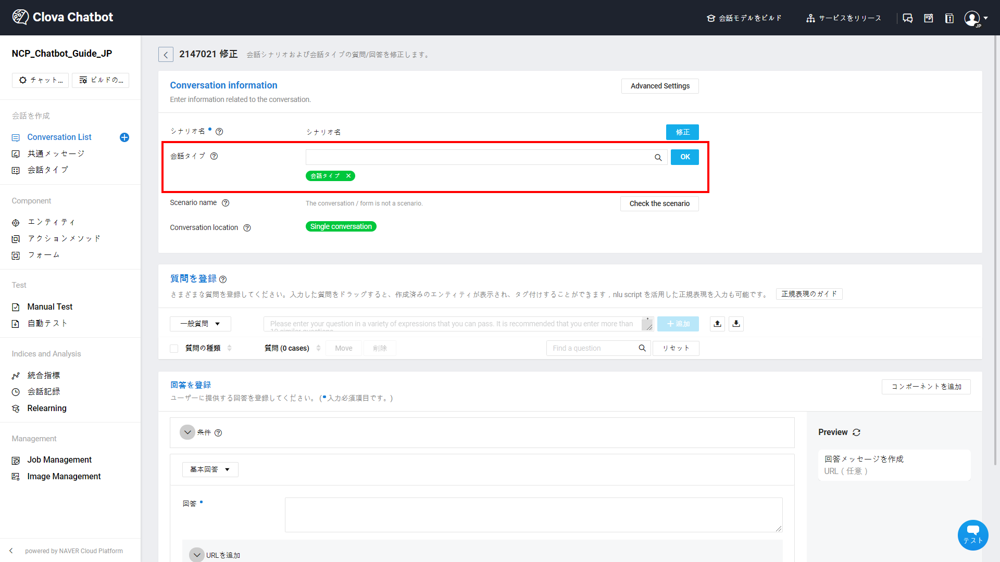
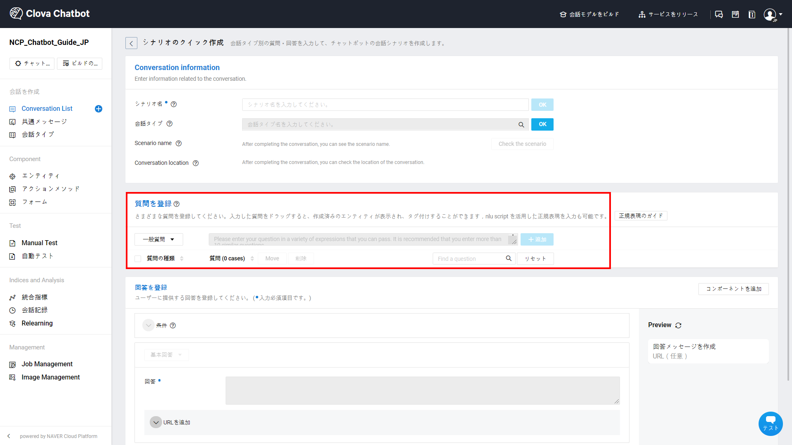
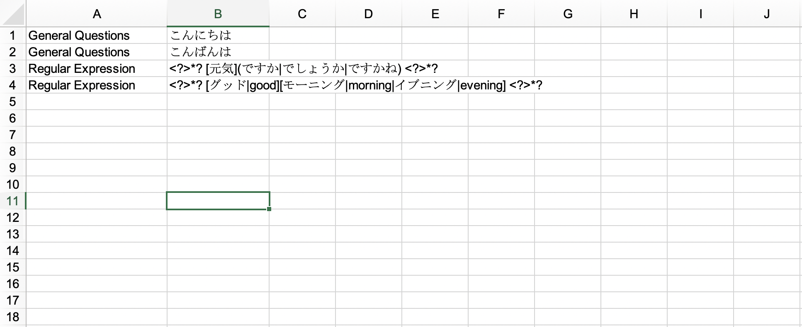
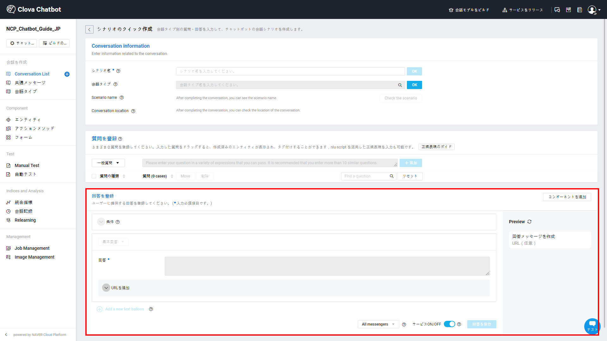
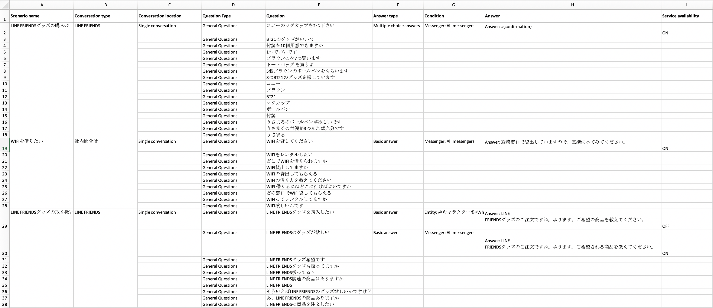
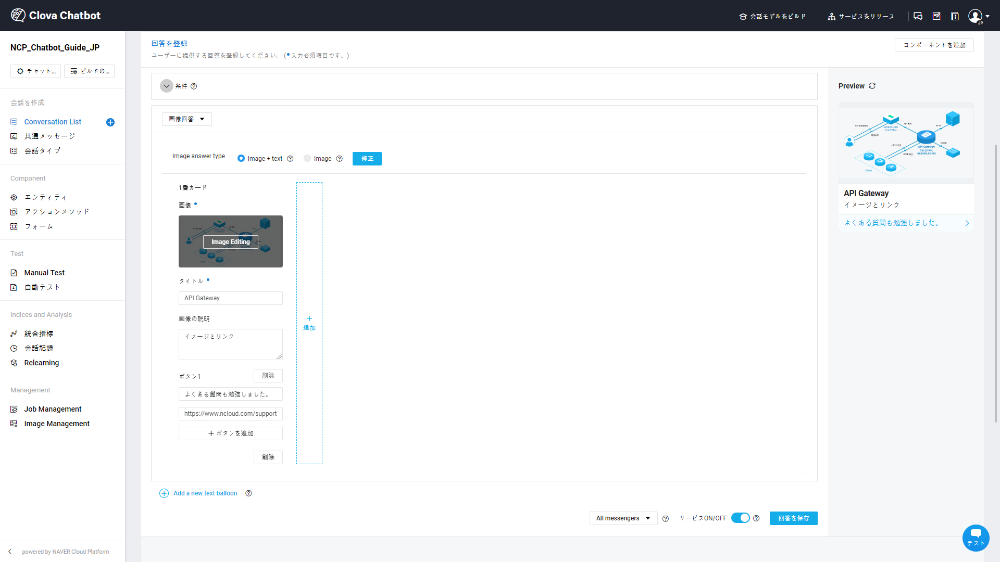
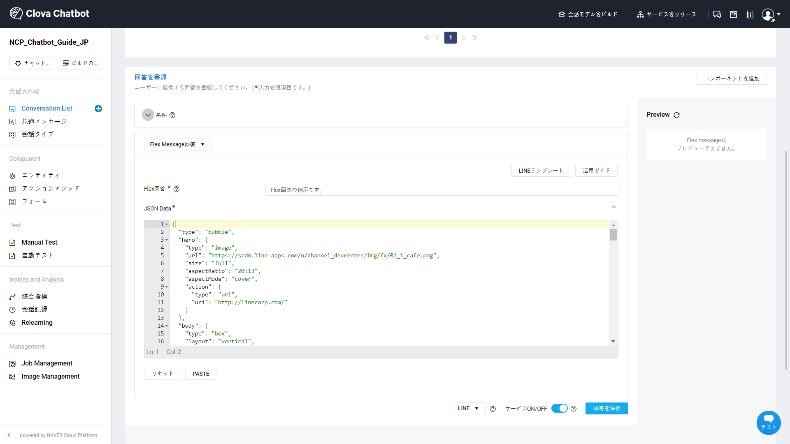
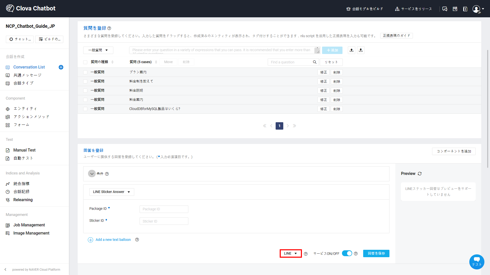
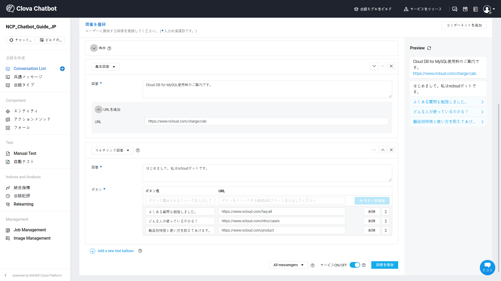

---
search:
  keyword: ['chatbot','チャットボット']
---

## Conversation Listの管理

Conversation Listで会話学習に必要な会話データセットを作成し、会話を管理します。

チャットボットビルダーは、チャットボットの会話データセットを入力してテストするWebコンソールで、チャットボット開発に必要なさまざまな機能を提供しています。

① 上段の **Conversation List** メニューをクリックします。

詳細検索から回答のタイプ、コンポーネント、会話（位置、種類、状態）、条件、作成/変更日を基準に会話を検索できます。

② 「会話の作成」ボタンをクリックします。

③ 会話名を入力します。

- 会話名は、他の会話と重複されない固有の名前で入力します。会話名を入力した後「確認」ボタンをクリックすると、会話の作成が終わります。

- 会話名は、Similar Answerまたは固定メニューを設定した場合、該当の会話名がユーザーにそのまま表示されます。そのため、会話名は今作成する会話内容を代表できるように注意を払って書きます。例えば、営業時間を確認する会話を作成する場合、会話のタイトルを「営業時間の確認」のように入力できます。

④ 会話タイプを入力します。

- 会話タイプは、多くのConversation Listを手安く管理するための機能です。オプションの入力値なので、入力が必須ではないですが、運用にあたり該当会話が持っている属性を把握して会話タイプを入力することをお勧めします。
- 例えば「会員登録の問い合わせ」という会話の会話タイプは、「問い合わせ」、「会員登録」などで入力できます。

⑤ 質問を登録します。

- 質問の数は多ければ多いほど良いです。しかし、文の語尾だけを拡張して質問の数を増やすよりは、さまざまな発話のタイプを入力したほうがより学習に役立ちます。

- 例えば、ユーザーが特定商品の料金が知りたい場合、どのように聞くかについて考えてみることができます。

  - 00商品いくら？
  - いくらで00商品買えるの？
  - 00商品高い？
  - 00商品の価格は？
  - 料金表あったら教えて
  - 00商品の見積もりくれない？
  - 00商品の社員割引の価格を教えて

  上記の例のように多様な発話タイプを入力すると、モデルがより多くのユーザーの発話を理解するに役立ちます。

- もし該当の会話に入力される質問がなければ、該当の会話は未完成の会話でモデル学習の対象から除外され、Failure Messageが返されることがあります。また、それぞれ違う会話に同じ質問を登録するとモデル学習に邪魔になることがありますので注意して入力してください。

- 質問を入力する際に、一般質問と正規表現質問の中から1つの質問タイプを選択できます。

  - 一般質問は、自然言語で入力された質問のことで、モデルの学習データとして活用されます。
  - さまざまな表現の文を圧縮的に表現すべきであれば、正規表現質問を活用します。ただし、正規表現質問はモデルの学習データとしては活用されません。
  - 正規表現の表記法についての詳細は、["正規表現の入力ガイド"](chatbot-3-8.md)を参照してください。

- 「アップロード」または「ダウンロード」ボタンをクリックし、大量の質問をExcelファイルでアップロードできます。

- 質問をアップロードするとき、指定されたアップロードファイルのフォーマットに合わせてください。適してないフォーマットは、アップロードに失敗することがあります。

  - A列：質問タイプ（「一般質問」または「正規表現質問」を選択して入力します。）
  - B列：質問（追加したい質問を入力します。）

  

- もし既に入力されている質問を他の会話に移動させたい場合は、質問を選択した後「移動」ボタンをクリックして他の会話に移動させることができます。

⑥ 回答を登録します。

- 回答のタイプを選択：基本回答（テキスト）以外にも、さまざまなタイプの回答を簡単に作成できます。詳細については["Conversation Listの管理"](chatbot-3-2.md)で取り扱います。

  - 基本回答
  - 画像回答
  - マルチリンク回答
  - 選択式回答
  - Flex Message回答
  - 連続回答
  - LINE Sticker Answer

- 条件：各回答に、ANDとORを組み合わせたさまざまな条件を設定することができます。

  - 5つのAND条件と10のOR条件で、最大50の条件設定が可能です。
- 条件が設定されている回答が、条件が設定されていない回答より優先に応答されます。また、条件が満たされる回答がない場合には失敗の発話が応答されることがありますので注意してください。

  - 時間条件：特定の時間帯にのみ応答する回答を設定できます。
  - 曜日条件：特定の曜日にのみ応答する回答を設定できます。複数の曜日を選択できます。
  - 日付条件：特定の日のみ応答する回答を設定できます。
  - エンティティ条件：特定のエンティティをユーザーが発話する、または発話しない場合のみ応答する回答を設定できます。
  - フォーム条件：特定の選択式フォームに対してユーザーが選択したボタンを覚えて、特定のボタンを選択する、または選択しないユーザーにのみ応答する回答を設定できます。
  - カスタム条件：自らカスタムした条件を回答に設定できます。　条件を検証するAPI URLを入力してください。
  - 複数の条件が追加された場合、すべての条件が満たされる場合のみ回答が応答されます。
  - 2つ以上の回答に設定された条件が同時に満たされる場合、ランダムで応答されます。 
    例：回答1に［火曜日］の条件を設定し、回答2に［12/25］と日付条件を設定した場合
    仮に12月25日が火曜日であれば、2つの回答がすべて条件を満たしているため、回答1と回答2がランダムで応答されます。

- メッセンジャーの設定：特定のメッセンジャーでのみ応答する回答を設定できます。仮に「すべてのメッセンジャー」の回答と特定メッセンジャーで設定した回答が同時にサービスONになっている場合、該当のメッセンジャーでは「すべてのメッセンジャー」で設定した回答は応答されません。

- 特定のメッセンジャーで対応しない回答タイプを選択した場合、ユーザーには失敗のメッセージが応答されることがあります。
- メッセンジャー条件をClovaに設定する場合、「基本回答」タイプのみ対応します。そして、「すべてのメッセンジャー」で設定した回答をClovaに連動する場合、各回答タイプの「テキスト回答」のみ音声で提供されます。

- サービスON/OFFの設定：回答のサービス状態をON/OFFで設定できます。複数の回答をサービスONに設定する場合、該当の回答がランダムに応答されます。例えば、特定の質問に対して2つ以上の回答がONになっている場合、 質問が来たら回答が登録された順番と関係なくランダムに応答が出ます。もし、ユーザーが約5時間内に同じ質問を追加で投げかけると、まだ表示されていない回答の中から応答が出ます。

- プレビュー：作成した回答のプレビューを確認できます。編集した内容がリアルタイムでプレビュー画面に反映されます。

- 回答：チャットボットが回答する文を作成します。

  - **回答** 入力欄に`$`や`#`を入力すると、アクションメソッドやフォームを素早く入力できます。
  - フォーム入力は、基本回答と選択式回答タイプのみ可能で、画像回答やマルチリンク回答など、形式が指定されたテンプレートの回答の場合にはフォーム入力ができません。詳細については["会話コンポーネントの管理"](chatbot-3-3.md)で取り扱います。
  - メッセージがLINEに設定されている場合、**回答** 入力欄で ``{0x000000}` 形式でLINEの絵文字を追加できます。入力できるLINE絵文字は["LINE Original emoji "](<https：//developers.line.biz/media/messaging-api/emoji-list.pdf>)から確認できます。

- URLの追加

  * URLアドレス：リンクするURLアドレスを入力してください。

- もし、該当の会話に入力された回答がなければ、該当の会話は未完成の会話でモデル学習の対象から除外され、Failure Messageが返されることがあるので注意してください。

⑦ Microsoft Excelを利用して会話を作成し、チャットボットに一括アップロードすることもできます。アップロードのタイプは、JSONアップロードと通常のアップロードがあります。

- Conversation Listで「アップロード」をクリックし、Excelファイルをアップロードします。

- 指定されたアップロードファイルのフォーマットに合わせてください。適してないフォーマットでアップロードすると、会話の作成に失敗することがあります。

- 一般会話の基本回答、画像回答、マルチリンク回答、選択式回答など一部の回答タイプのみ、Excelのアップロード/ダウンロードに対応します。スロット会話は、Excelのアップロード/ダウンロードに対応しません。

- Excelのアップロードにより、新しい会話の新規作成だけでなく、既存の会話に質問または回答を追加できます。

  - A列：会話名（既存の会話名と重複しない名前を入力すると、新しい会話が生成されます。重複した名前を入力した場合、既存の会話に質問または回答が追加されます。）
  - B列：会話タイプ（複数の会話タイプを選択する場合「|」記号を使って区別します。）
  - C列：Conversation location（シナリオ上のConversation locationを入力します。Start、Intermediate、Last、Singleの中から選択します。）
  - D列：質問タイプ(一般質問と正規表現質問の中から選択します。）
  - E列：質問(複数の質問を入力する必要がある場合、下に行を追加して入力します。）
  - F列：メッセンジャー条件（すべてのメッセンジャー、LINE、LINE WORKS、カカオトーク、NAVER TalkTalk、Facebook、Custom、Clovaの中から選択して入力します。）
  - G列：条件（該当する回答を応答する条件を選択します。）
      - 条件なし：条件の列を空欄にしておきます。
      - 複数条件：（条件1OR条件2）AND（条件3の形式で入力します。全ての条件は括弧で囲んで入力する必要があります。
      - 時間条件：24時間表記法で入力します。
      - 曜日条件：「月～日」の中から選択して入力します。
      - 日付条件：「月/日~月/日」フォーマットで入力します。
      - エンティティ条件：@エンティティ名 = 代表語または@エンティティ名 ≠ 代表語の形式で入力します。
      - フォーム条件：#{フォーム名} = ボタン名または #{フォーム名} ≠ ボタン名の形式で入力します。
　    - カスタム条件：endpointを入力します。

- H列：回答のタイプ（作成する回答のタイプを指定します。基本回答、マルチリンク、画像、選択式回答の中から1つのみ選択できます。それ以外の回答タイプは、アップロード/ダウンロードに対応しません。）

- I列：回答（複数の回答を入力する必要がある場合、下に行を追加して入力します。選択入力の値は、入力しなくてもいいです。）

  - 基本回答

    回答：回答メッセージを入力します。改行が必要であれば「\n」記号を入力します。

    URL：URLアドレスを入力します。

  - マルチリンク

    回答：回答メッセージを入力します。

    ボタン1：URLアドレスを入力します。

  - 画像回答

    [画像カード]
    画像回答タイプ：画像回答のタイプを選択します。「画像」または「画像＋テキスト」の中から1つを選択して入力します。
    タイトル：画像のタイトルを入力します。
    画像の説明：画像を説明する回答を入力します。
    ボタン1：ボタン名を入力します。（URLアドレスを入力します。)

　- 選択式回答

  　回答：#{選択式フォーム名}の形式で入力します。

　- J列：サービス状況（該当する回答のサービス状況をON/OFFで入力します。）

### 豊富な回答を作成する方法（回答のタイプを選択）

チャットボットサービスでは、回答を豊富に提供できるようにさまざまな回答タイプを提供しています。
現在、基本回答、画像回答、マルチリンク回答、選択式回答、Flex Message回答、LINE Sticker Answerをサポートしており、引き続きさらに多様なタイプの回答を開発しています。また、メッセンジャーに連動する場合、該当メッセンジャーがサポートする回答コンポジットのタイプに変換され提供されます。作成した回答のタイプによっては、メッセンジャー仕様から提供していない場合もありますので、使用する前に確認が必要です。

① 画像回答

画像回答は、複数の画像とボタンを活用した回答です。image + textとimageの中から、希望する画像回答タイプを選択できます。image + textとimageタイプは、画像に補足説明を追加でき、imageタイプは画像のみで回答が応答されます。画像回答を入力する方法は以下のとおりです。

- image answer type：画像のタイプを選択してください。
  - image + text：画像とテキストを一緒に表示できるタイプです。URLボタンを追加できます。
  - image：画像のみ表示するタイプです。URLアドレスを追加する場合、画像をクリックすると該当URLに遷移します。
- 画像の登録：画像をアップロードするか、URLを入力して画像を登録してください。
  * おすすめのサイズは、270X150pxです。
  * ファイルで画像をアップロードする場合、crop機能を使用して適切な画像サイズや比率に調整できます。（URLで画像を登録する場合、編集機能を提供していません。）

  * BasicとStandardプラン両方とも最大50枚まで、画像を登録できます。
- 画像の修正：すでに登録されている画像を他の画像に変更したり、サイズを調整できます。
- タイトル：登録した画像と一緒に表示する文言を入力してください。
- 画像の説明：登録した画像を説明できる回答を作成してください。画像回答ではフォーム入力ができず、基本回答と選択式回答タイプでのみ可能です。
- ボタンの追加：最大3つのボタンを追加できます。

  - 複数の画像を追加する場合、各画像カードのボタンの数はすべて統一される必要があります。
- 画像カード追加：最大10枚の画像カードを追加できます。2つ以上の画像カードを追加する場合、カルーセル形式で実装されます。
- 画像カードの順番の調整：画像カードの順番を変更できます。

② マルチリンク回答

マルチリンク回答は、複数のURLボタンを活用した回答です。マルチリンク回答を入力する方法は以下のとおりです。

- 回答：URLボタンを説明できる回答を作成してください。マルチリンク回答では、フォーム入力ができず、基本回答と選択式回答タイプでのみ可能です。
- URL名：ユーザーにURLの代わりに表示する文言を入力してください。
- URLアドレス：リンクするURLアドレスを入力してください。
- ボタンを追加：すべてのメッセンジャーベースで最大10のボタンを追加できます。
  （ただし、LINE、Facebook、KakaoTalkでは、4つのボタンまで追加できます。）
- ボタンの順番の調整：ボタンの順番を調整できます。

③ 選択式回答

選択式回答は選択式フォームを活用し、さまざまな選択肢に応じて違う回答をする回答タイプです。選択式回答を入力する方法は以下のとおりです。

- フォーム名：フォームの名前を先に設定する必要があります。フォーム名は重複しないようにすることで、新規名前を入力したりすでに登録されているフォームを検索で取り込むこともできます。新しいフォームを作成する場合、従来のフォームデータと重複しない名前で入力します。
- Button type:Multiple choice buttonとQuick replyタイプの中からボタンのタイプを選択できます。
- 回答：選択式フォームを説明する回答を入力してください。選択式回答では、フォーム入力が可能で、それによりさまざまなパターンの会話を設計できます。
- ボタン
  - ボタン名：選択式ボタンに表示される文言を入力してください。
  - ボタンアクション：ユーザーがボタンをクリックすると、システムが応答する回答を入力します。
    - Conversation Link：すでに登録されている会話をリンクし、該当会話に登録されている回答を応答することができます。リンクされた会話の回答を確認するためには、右側の「Check Answer」ボタンをクリックしてください。もし、存在していない会話名を入力した場合、該当する会話名の会話が自動で作成されます。また、シナリオ中でのループを制限しており、一部の会話はリンクができない場合があります。
    - テキスト回答：一般のテキストまたはフォーム、アクションメソッドを入力できます。を入力できます。
  - ボタンの追加：すべてのメッセンジャーベースで、基本的に選択式ボタンは最大10まで追加可能です。（ただし、LINE、Facebook、KakaoTalkでは、4つのボタンまで追加可能です。）
    Quick replyタイプは、すべてのメッセンジャーで最大10の選択式ボタンを追加できます。
  - ボタンの順番の調整：選択式ボタンの順番を変更できます。
- サービスリンク：フォームにLINE Switcher APIまたはLINE PAYのようなアクションメソッドを入力した場合、該当サービスへの連動を選択してから **統合指標**で正確な指標を確認できます。
  - 連動された多数のサービスをまとめて登録できます。
  - フォームに連動されたサービスの中、ユーザーが選択したボタンは、**統合指標**で「成功」と集計され、応答されなかった他のサービスは「拒否」として集計されます。

選択式回答を作成して複雑なシナリオを構成する場合、会話と選択式フォーム間のリンクが把握しにくいことがあります。その場合は、シナリオ項目を確認することで、会話と選択式フォーム間のリンクの構造を簡単に把握することができます。

- シナリオ項目では、該当の会話が属しているScenario nameとConversation locationを確認できます。リンクの構造を確認するためには、「Check the scenario」ボタンをクリックします。

- シナリオの構造は、会話、選択式フォーム、シナリオリストから確認可能です。

- Scenario name：該当シナリオの名前です。シナリオが作成されると、自動で付けられますが修正可能です。
- シナリオの構造：選択した会話のシナリオ構造を表示します。複雑に絡んでいるシナリオの構造を把握しやすくするため、選択した会話とリンクされている一部のブロックのみ表示しています。隠れているリンクの構造を確認したい場合は、破線で表示されているブロックをクリックして閲覧します。このとき、上部のナビゲーションバーから会話閲覧のヒストリーを確認できます。
- 実線で表示されたブロック：該当のブロックにリンクされた隠れている会話またはフォームが存在しない場合、実線で表示されます。
- 破線で表示されたブロック：該当のブロックにリンクされた隠れている会話またはフォームが存在する場合、破線で表示されます。クリックし、隠れているブランチを閲覧できます。
- Create new conversation：新規会話を作成するページに遷移します。
- 修正：該当選択式フォームの編集ページを閲覧します。
- 更新ボタン：シナリオを更新します。シナリオ構造に変更がある場合、それを確認するためには更新してください。
- 拡大/縮小：カンバスを拡大または縮小できます。

④ Flex Message回答

Flex Message回答は、LINEメッセンジャー専用のさまざまなレイアウトを活用した回答です。Flex Message回答を入力する方法は以下のとおりです。

- Flex回答：JSONデータについてテキストの説明を入力してください。
  - 必要に応じて（プッシュ通知、チャットの要約、flexメッセージをサポートしないプラットフォームなど）代替テキストでユーザーに表示されることがあります。
- JSON Dataを入力：新規のJSON DATAを入力してください。
- LINEテンプレートのボタンをクリックすると、LINEが提供するサンプルのテンプレートを編集したり新しく作成できます。
- 完成されたJSONデータをコピー/ペーストできます。

⑤ LINE Sticker Answer

LINE Sticker Answerは、LINEメッセンジャー専用のさまざまなStickerを活用した回答です。LINE Sticker Answerを入力する方法は以下のとおりです。

- メッセンジャーを設定：LINEメッセンジャーに設定した場合のみ、LINE Sticker Answerタイプを選択できます。
- Package ID：使用したStickerのpackage IDを入力します。
- Sticker ID：使用したStickerのSticker IDを入力します。
-  Package IDとSticker IDは ["Sticker List"](<https：//developers.line.biz/media/messaging-api/sticker_list.pdf>)を参考に入力します。

⑥ 連続回答

連続回答は、さまざまな回答タイプを組み合わせ、連続した吹き出しで応答する回答のことを言います。連続回答を入力する方法は以下のとおりです。

- Add a new text balloon：さまざまな回答タイプを新しい吹き出しで追加できます。
  - 最大5つの吹き出しを追加できます。
  - 基本回答、画像回答、マルチリンク回答、選択式回答、LINE Sticker Answerのみ連続回答で構成できます。
  - 画像回答の場合、カルーセル形式をサポートしておらず、1つの吹き出しには1つの画像のみ追加できます。
  - 選択式回答の場合、連続回答で1件のみ追加可能です。
  - 一部のメッセンジャーでは、連続回答機能をサポートしておらず、Failure Messageを応答することがあります。

### Advanced Settings

各会話では一部の詳細機能を設定できます。コンテキストを設定してマルチターンを構成したり、一般会話またはスロット会話に会話のタイプを変更できます。また、ネガティブ設定から学習モデルに役立つネガティブデータを構成したり、会話ごとにフィードバック応答メッセージを区別して設定することができます。

① Context settings

contextは、リンクされている会話の脈絡を把握することに活用します。もし、A会話のoutput contextとB会話のinput contextが一致するとしたら、A会話がマッチングされてからはcontextがない他の会話よりcontextが一致するB会話がより優先にマッチングされます。もし、選択式回答からリンクされている会話があれば、contextより選択式ボタンにリンクされている会話が優先になります。

- Input context：モデルは、入力されたInput contextと以前行った会話からユーザーのログに残っているcontextを比較し、脈絡を把握します。もし、ユーザーログに残っているcontextと該当会話のInput contextが一致すれば、モデルは同じ脈絡で判断します。
- Output context：該当の会話が終了した後、ユーザーのログに残すcontextを入力します。設定された回数または時間が超過すると、contextは削除されます。
  - Limit number of times：ユーザーのログに残すcontextの寿命を回数で制限します。会話のターンが過ぎるたびにcontextの回数が差し引かれ、全部差し引かれた後は、該当のcontextがユーザーのログから削除されます。ただし、スロット会話の聞き返しはcontextの寿命とは関係ないです。
  - Timeout：ユーザーのログに残すcontextの寿命を時間で制限します。設定された時間が超過してからは、該当のcontextがユーザーのログから削除されます。

contextが維持される間は、収集したスロット情報を覚えます。そのため、以前の会話から収集したスロット情報を取り込んで活用するなど、さらに複雑なサービス構成が可能になります。contextでスロット情報を維持する詳細については[チャットボットのAdvancedガイド](chatbot-3-5)で取り扱います。

② Conversation type

チャットボットサービスのシナリオによって一般会話またはスロット会話を選択できます。

ユーザーの発話から意図を把握し、登録されている回答を応答する簡単な会話を構成する場合は、一般会話が適しています。ほとんどのチャットボットは、一般会話のみを使用してサービスを構成できます。一方、ユーザーとのインタラクティブな会話からスロットを収集し、収集したスロットを利用して特定タスクを行う複雑なフローの会話を構成したい場合は、スロット会話を選択します。スロット会話を構成する方法についての詳細は、[チャットボットのAdvancedガイド](chatbot-3-5)を参考してください。

③ ネガティブ

- Negative settingは、似ている会話間の違いをモデルに学習させるために活用します。似ている質問が登録された会話またはモデルが区別できない他の会話を選択し、ネガティブに登録します。これにより、モデルは登録されたネガティブ会話と現在の会話との違いを区別できるようになります。
- 効率のいいモデル学習のために、ネガティブに登録できる会話の数を制限しており、最大20の会話をネガティブに登録できます。

④Set feedback response

- Feedback response message：該当会話のフィードバック応答メッセージを選択できます。フィードバック設定ページで登録した他のフィードバック応答メッセージに変更しない場合、基本の応答メッセージに設定されたフィードバックがデフォルトで応答されます。

### 共通メッセージの管理

共通メッセージとは、会話データセット以外に共通で設定できるチャットボットのメッセージのことを言います。共通メッセージには、ウェルカムメッセージ、Failure Message、固定メニュー、フィードバック、Similar Answer、プッシュメッセージがあります。

① ウェルカムメッセージ

チャットボットがユーザーに送信する初回のメッセージのことを言います。ウェルカムメッセージを設定する方法は以下のとおりです。

- さまざまな回答のタイプを活用し、ウェルカムメッセージを作成できます。
- 最大3つのウェルカムメッセージを作成できます。
- ウェルカムメッセージが登録されたいない場合、メッセンジャーごとに基本のウェルカムメッセージが送信され、メッセンジャーによってウェルカムメッセージをサポートしない場合もありますので注意してください。

② Failure Message

ユーザーの質問に対して応答する回答が見つからなかった場合、代わりに応答するFailure Messageを作成できます。

なお、システムエラーのため回答を応答できない場合、代わりに送るシステムエラーメッセージも作成可能です。

- Failure Message
  - Failure Messageは、さまざまな回答タイプを活用して作成可能です。
  - 登録されたFailure Messageが存在しないか、条件を満たすFailure Messageがない場合、デフォルトのFailure Messageが応答されます。
- システムエラーメッセージ
  - システムエラーメッセージは、テキスト回答のみ作成可能で、アクションメソッドまたはフォーム入力ができません。
  - 登録されたシステムエラーメッセージが存在しない場合、デフォルトのシステムエラーメッセージが応答されます。

③ Slot Stop Message

スロット会話の途中、ユーザーが直ちに会話を中断したい状況になることがあります。しかし、ユーザーがスロットとは関係ない話をしてもチャットボットはスロットを埋めるために聞き返す質問を続けます。このような状況で、スロット停止キーワードとメッセージを活用し、ユーザーは強制的にスロット会話を止めることができます。

- Slot Stop Message
  - ユーザーがスロット会話の途中、スロット停止キーワードを入力した場合、直ちにスロット会話をちゅうしして登録されたSlot Stop Messageを応答します。
- スロット停止キーワード
  - スロット停止キーワードは、スロット会話の中でのみ動作します。
  - 最大10件のキーワードを登録でき、exactで同じ質問が入力された場合のみ動作します。

④固定メニュー

固定メニューは、チャット画面の下段で開閉できるメニューです。固定メニューを設定する方法は以下のとおりです。

- 固定メニュー名：チャットバーに表示される固定メニューの名前を設定できます。
- メニューボタンの構成：画像メニューまたはTextメニューを選択できます。
- 画像メニューのレイアウト：3つの画像レイアウトの中から選択できます。
- ボタンの設定：該当ボタンの画像を登録し、ボタンアクションを設定できます。
  - ボタンアクション：ボタンをクリックするとリンクされる動作を選択してください。すでに登録されている会話またはURL連動が可能です。
  - 画像名：ボタンをクリックすると、ユーザーの吹き出しに表示される画像名を入力してください。
  - 画像を登録：画像をアップロードするか、URLを入力して画像を登録してください。（各レイアウトのおすすめサイズを確認してください。）

- テキストメニュー：
  - 最大4つのテキストボタンを追加できます。
- プラットフォーム連動設定：作成された固定メニューをプラットフォームに連動してください。**プラットフォーム連動設定** ボタンをクリックし、連動したいプラットフォームの **設定** ボタンから固定メニューを選択できます。

⑤ フィードバック

フィードバックは、チャットボットの回答をユーザーが評価できる機能です。フィードバックを設定する方法は以下のとおりです。

- フィードバック方式を選択：フィードバック回答の表示方式を選択してください。会話の終了時に、フィードバックを表示したり、選択した会話にフィードバックを表示できます。
  - Feedback Exposure at End of Conversationを選択した場合、ユーザーが1~15分間応答がなかったら、自動的にフィードバックが表示されます。
  - Exposure feedback to selected conversationを選択した場合、全体の回答や一部の選択された回答が応答された後、フィードバックが表示されます。（すべての回答に表示を選択する場合、フィードバックを除外する会話を選択でき、一部の回答に表示を選択する場合、フィードバックを表示する会話を選択できます。)
- フィードバックの文言：希望するフィードバック回答の文言を入力してください。
- フィードバックをクリックすると応答：ユーザーがフィードバックに応答する場合、YesかNoの回答を設定できます。（最大3つ）
  - default reply messageに設定されたフィードバックへの応答がすべての会話に適用され、各会話の修正-[詳細設定]-[フィードバックへの応答の設定]で設定された応答メッセージを変更できます。
  - ボタンアクション：ユーザーがボタンをクリックすると、システムが応答する回答を入力します。
    - 会話連動：すでに登録されている会話の回答を応答することができます。連動された会話の回答を確認するためには、右側の「回答の確認」ボタンをクリックしてください。
    - テキスト回答：一般テキストまたはフォーム、アクションメソッドを入力できます。

⑥ Similar Answer

Similar Answerは、ユーザーの質問に対してシステムがマッチングされた会話が見つからなかった場合、Failure Messageを応答する代わりに「accuracy middle」区間に該当する会話をカルーセル形式でユーザーに見せる機能です。Similar Answerを使用する方法は以下のとおりです。

- サービスの有無：Similar AnswerサービスをONまたはOFFに設定可能です。Similar Answerの設定を保存した後、ビルドを完了してからサービスに反映されます。

  - サービスON：サービスをONに設定した場合、マッチングされた会話がなければ、「accuracy middle」に該当する会話をユーザーに見せます。
  - サービスOFF：サービスをOFFに設定した場合、マッチングされる会話がなければ、Failure Messageを応答します。

- ビルド/サービス情報：現在、ベータとサービス環境でSimilar Answerサービスを反映したかどうかを確認できます。

- Similar Answerの登録

  - Similar Answer：ユーザーに見せるSimilar Answerメッセージを入力します。
  - 最大Similar Answerの数：ユーザーに見せる最大Similar Answerの数を1~5つの間から設定できます。最大Similar Answerの数を5つに設定しても「accuracy middle」に該当するシナリオが1つだけ存在すれば、Similar Answerは1つだけ表示されます。

⑦ プッシュ―メッセージ

プッシュ―メッセージは、ユーザーに自動でメッセージを送信できる機能です。プッシュ―メッセージを送る方法は以下のとおりです。

- Transmission messenger：送信対象のメッセンジャーを選択できます。（LINEとNaver talktalkに対応）
- 送信方法：送信方法を選択できます。
- プッシュ―メッセージのタイプ：基本テキスト、マルチリンク、画像、Flex Messageを活用し、さまざまなタイプのプッシュ―メッセージを作成できます。
- メッセージ送信履歴からは、送信されたMessage ContentsやMessage Sent Date、Success/failureの件数を確認できます。

### 会話タイプの管理

会話タイプとは、会話を管理するための目的で使用されます。

１つの会話には、複数の会話タイプを登録できます。タグ形式で多様な会話タイプを入力し、効果的に管理できます。

① **会話タイプ**をクリックすると、会話タイプを作成・管理できます。

② 会話タイプ名を入力し、**追加**をクリックするかEnterキーを押して会話タイプを作成できます。

## 関連情報へのリンク

ドメインの作成、Conversation Listとコンポーネントの管理および統計管理に関しては以下の利用ガイドを参照してください。

- Chatbotスタートガイド
  - [チャットボットを開発する前に考えること](chatbot-1-2_ja.md)
  - [チャットボットのクイックスタートガイド](chatbot-1-1_ja.md)
  - [チャットボットのよくある質問](chatbot-1-3_ja.md)    
- Chatbotご利用ガイド
  - [ドメイン管理](chatbot-3-1_ja.md)
　- [Conversation Listの管理](chatbot-3-2_ja.md)  
  - [会話コンポーネントの管理](chatbot-3-3_ja.md)
  - [統計の管理](chatbot-3-4_ja.md)
  - [チャットボットのAdvancedガイド](chatbot-3-5_ja.md)
  - [正規表現の入力ガイド](chatbot-3-8_ja.md)
  - [チャットボットのCustom API Spec.](chatbot-3-7_ja.md)
- チャンネル連動ガイド
  - [LINE連動](chatbot-2-1_ja.md)
- Agent Connectionsガイド
  - [LINE Switcher API連動](chatbot-2-7_ja.md)
