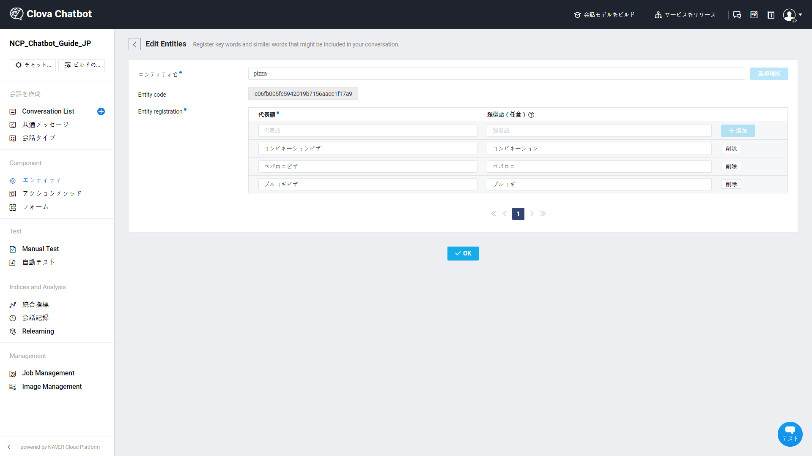
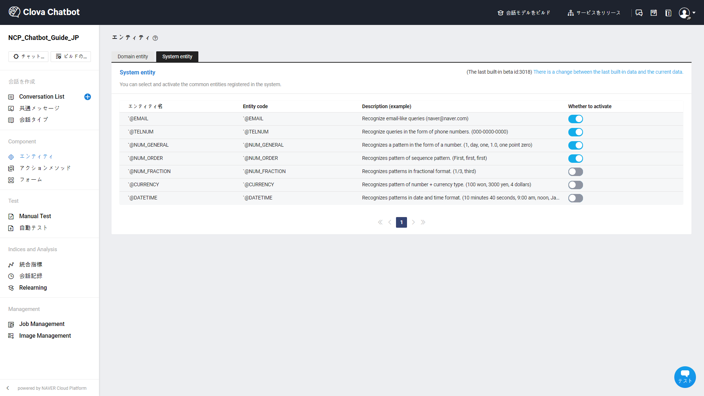
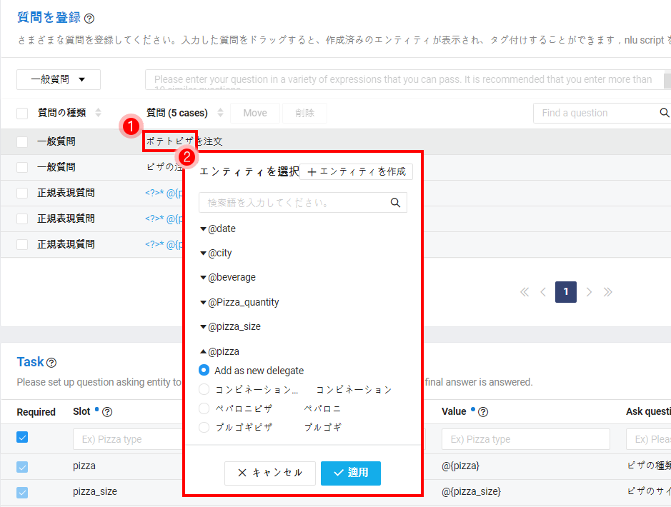
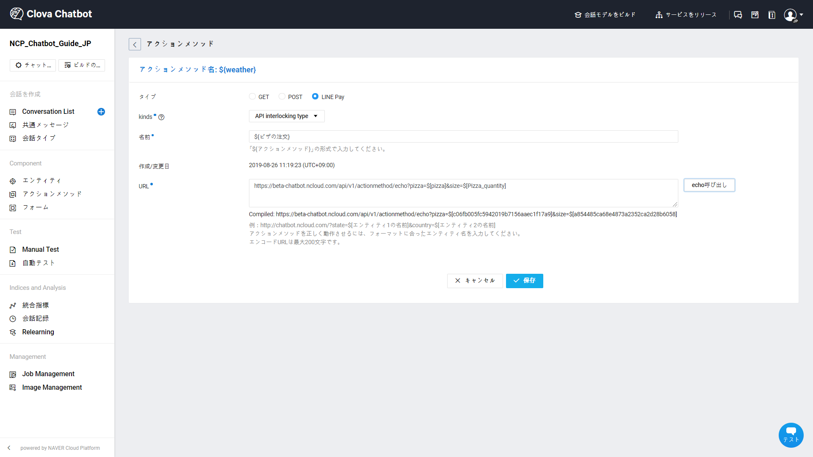

---
search:
  keyword: ['chatbot','チャットボット']
---

## 会話コンポーネント

**会話コンポーネントは、自然言語ベースのチャットボットエンジンの特性をきちんと理解したうえ、本当に必要な時にだけ使ってこそ効果があります。**

会話作成方法に慣れましたら、高級機能である会話コンポーネントを活用してみてください。
会話コンポーネントという機能は、チャットボットの回答でよりユーザーにやさしい回答をするに役立つ機能です。

NAVERクラウドプラットフォームのチャットボットは、3つの会話コンポーネントを提供します。

- エンティティ：人名、機関名、場所、日付と商品名などドメイン特化した単語が登録されている辞書を意味します。
- アクションメソッド：外部のURLを呼び出し、その応答の結果値を回答に含めて提供する機能です。
- フォーム：選択式の選択肢を提供するか自由回答式の回答を誘導し、それに伴うフィードバックでシナリオが続く機能です。

> 従来提供していたタスク機能は7/25をもって除外されます。その代わりに、より高度化した機能のスロット会話を使うことができます。詳細は [チャットボットのAdvancedガイド](chatbot-3-5.md)を参考してください。


### エンティティ

エンティティは、人名、機関名、場所、日付と商品名などドメイン特化した単語が登録されている辞書を意味します。

エンティティには、ビルドインで登録されたすべてのドメインで共通で使用可能なシステムエンティティと、作業者が直接登録して特定ドメインでのみ使用可能なドメインエンティティに分けられます。エンティティを作成、修正、削除した後には、ビルドまたは変更された設定の適用を完了してからモデルに反映されるので、参考にしてください。

① ドメイン エンティティ


エンティティ作成ボタンをクリックしてエンティティを作成できます。




- エンティティ名：エンティティの名前を入力します。
- エンティティコード：該当エンティティに与えられたコードが表示されます。
- 代表語：エンティティに登録する代表語を入力します。
- 類似語：さまざまな表現の類似語を入力します。複数の類似語を入力する場合、コンマ（,）で区別します。

ドメインエンティティ内で重複される単語を代表語または類似語に登録できないので、注意が必要です。


② システムエンティティ



- 該当のドメインで使用するシステムエンティティを有効化することができます。
- もしスロット会話または正規表現の質問で、該当システムエンティティを参照している場合、無効化できません。


③ エンティティのタグ付け

登録されたエンティティは、会話の一般質問にタグ付けできます。エンティティを登録した後モデルビルドが完了されたら、一般質問を入力するときに、自動で該当のエンティティがタグ付けされます。もし手動でエンティティをタグ付けする場合は、以下のような手順で行います。

1. まず、「ポテトピザ」をマウスでドラッグして選択します。
2. エンティティの選択画面が出てきたら、タグ付けしたいエンティティを選択します。
3. 新しい代表語で追加するか、すでに登録されている代表語の類似語で追加することができます。
4. もしエンティティがない場合 **エンティティの作成**をクリックして新規作成します。



エンティティがタグ付けされている場合は、会話の質問にエンティティが青色で表示されます。このようにエンティティがタグ付けされている質問は、モデル学習に反映され、ユーザーの発話を認識するに役立ちます。


### アクションメソッド

アクションメソッドは、`${ActionMethodName}`の形で提起され、GETとJSON（POST）そしてLINE PAY、計３つの方式を提供します。

① GET方式


GET方式は、まずアクションメソッド名を定義し、外部URLを定義します。GET方式のアクションメソッドは、URL呼び出しの結果値が回答の内容として入ります。

例えば、回答を"現在チョンジャ洞の気温は ${weather}度です。"と定義した場合、 ${weather}の値は定義したURLを呼び出してResponseに返ってくる情報です。この値が「24」であれば、チャットボットは"現在チョンジャ洞の気温は24度です。"と回答します。

② JSON（POST）形式

JSON（POST）形式はGET方式と同じだが、URL呼び出しにデータを含めて送ることができます。データを送る形式はJSON形式です。


③ LINE PAY

LINE PAYのアクションメソッドを利用し、便利にLINE PAYで決済するシナリオを構成できます。

[LINE PAY連動ガイド](chatbot-2-8.md)を参考に、LINE PAYサービスを連動してから利用してください。


- 価格入力型

  

  - 入力された価格でLINE PAY決済を行います。価格の変動がない商品を決済するときには活用することをお勧めします。

  - 名前：価格入力型の場合、アクションメソッドの名前を直接入力しません。価格情報と商品名を入力すると、アクションメソッドの名前が自動完成されます。

  - Price information：決済する価格を入力します。基準通貨円（¥）です。

  - Product name：決済する商品の名前を入力します。

- API 連動型

  

  - 入力された外部のURLを呼び出し、確認された価格でLINE PAY決済を行います。価格が固定されたいないか、ユーザーが選択したスロット情報によって価格が変動される場合に活用することをお勧めします。
  - 名前：アクションメソッドの名前を入力します。
  - URL：価格情報を確認できる外部のURLを入力します。

例えば、ユーザーがコンビネーションピザのSサイズを2枚注文したのであれば、以下のスロット情報を外部のURLに送ります。Responseで返ってくる値が「49900」であれば、チャットボットは49,900ウォンをLINE PAYで決済します。

```
@ピザ：コンビネーションピザ
@ピザのサイズ：Sサイズ
@ピザの数量：2枚
```


### フォーム

フォームは、ユーザーの質問によって選択式および自由回答式の質問を提供し、その回答のフィードバックで会話が続く機能です。

フォーム名を定義すると、回答で `#{FormName}`の形でコンポーネントを使用できます。

フォームは、以下の2つのタイプを提供します。

- 選択式: 選択式ボタンの中から1つのボタンを選択するようにします。


例えば、顧客に確認を受けるYes/Noを選択式フォームで作った場合、このコンポーネントをさまざまなケースに使うことができます。フォームを適用するためには、 **１）選択式回答タイプ**を選択してフォームを取り込むか、**2）回答入力画面で#を入力**し、フォームリストが見えると状況に応じて選択・適用します。


 - 自由回答式：チャットボットの質問に、ユーザーからのText応答を受け取って回答を提供するようにします。

自由回答式フォームでは、ユーザーが先に質問すると、自由回答式フォームの案内文を先に応答します。そして、ユーザーからの入力があれば、自由回答式フォームの回答をチャットボットで出します。応答の流れは以下の通りです。

```
ユーザー：見積もりの問い合わせ

チャットボットの回答：案内メールの受取が可能なメールアドレスを入力してください。入力した情報は担当者に伝わります。     
==> （FORMの案内文）

ユーザー: abc@linecorp.com

チャットボットの回答：担当者にメールアドレスを送りました。ありがとうございます。
==> （FORMの回答）

```


自由回答式フォームの回答が出る場合、該当メッセージにアクションメソッドが存在するのであれば、該当アクションメソッドのヘッダーにX-KAA-USERMSGをkeyにしてutf-8にインコーディングされたメッセージが送信されます。


## 関連情報へのリンク

ドメインの作成、Conversation Listとコンポーネントの管理および統計管理に関しては以下の利用ガイドを参照してください。

- Chatbotスタートガイド
  - [チャットボットを開発する前に考えること](chatbot-1-2_ja.md)
  - [チャットボットのクイックスタートガイド](chatbot-1-1_ja.md)
  - [チャットボットのよくある質問](chatbot-1-3_ja.md)    
- Chatbotご利用ガイド
  - [ドメイン管理](chatbot-3-1_ja.md)
　- [Conversation Listの管理](chatbot-3-2_ja.md)  
  - [会話コンポーネントの管理](chatbot-3-3_ja.md)
  - [統計の管理](chatbot-3-4_ja.md)
  - [チャットボットのAdvancedガイド](chatbot-3-5_ja.md)
  - [正規表現の入力ガイド](chatbot-3-8_ja.md)
  - [チャットボットのCustom API Spec.](chatbot-3-7_ja.md)
- チャンネル連動ガイド
  - [LINE連動](chatbot-2-1_ja.md)
- Agent Connectionsガイド
  - [LINE Switcher API連動](chatbot-2-7_ja.md)