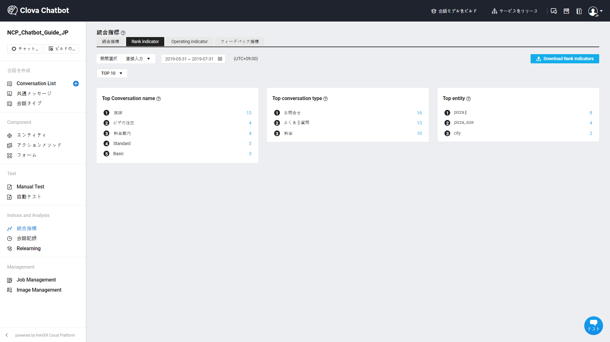
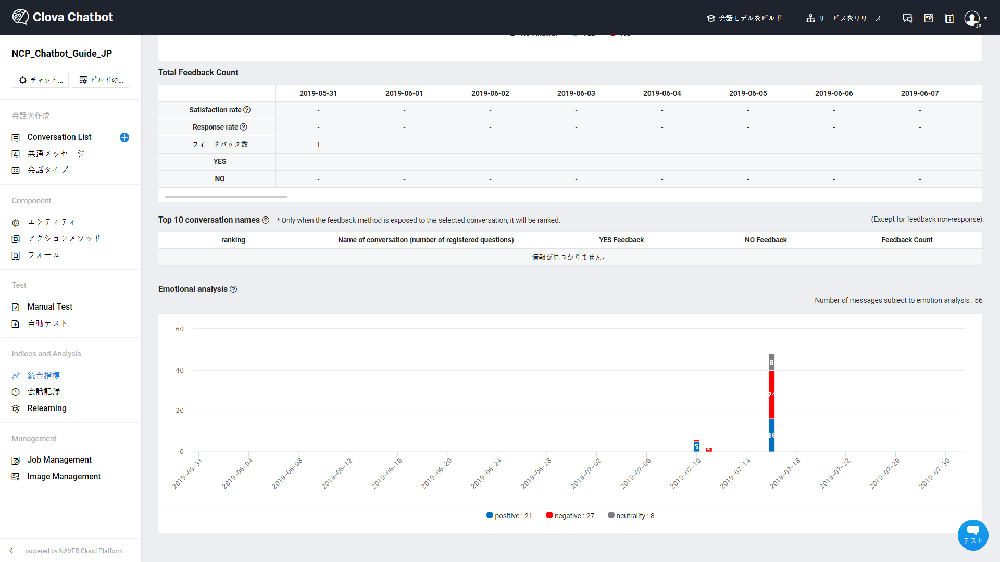

---
search:
  keyword: ['chatbot','チャットボット']
---

## 統計管理

実際のチャットボットサービスでは、実ユーザーの利用方式が会話の作成過程で想定していた発話タイプと違うことがあります。また、モデリングのときにすべてのユーザーの発話パターンを代弁したわけではないため、統計データおよび流入されたユーザーの発話記録の分析が重要です。LINE BRAINでは、継続的なモデル改善ができるように、多様な分析指標を提供します。

LINE BRAIN CHATBOTでは、ドメイン管理および統計機能を提供します。

### Domain

作成されたドメインの基本情報を提供します。

### 統合指標

- チャットボットユーザーおよびユーザーの会話について以下のような統計データを提供し、最近反映されたデータの時間を表示します。
  - チャットボットサービスの実ユーザー、ユーザーメッセージ、会話セッションの件数および増減率、Failed conversation、一般メッセージの件数、Single Answerの件数、Similar Answerの件数、Agent Connectionsの件数、LINE payサービス連動、知識検索サービス連動の件数など
  - 平均の実ユーザーおよび会話セッションごとの平均メッセージ情報および推移

- チャットボット実ユーザーの増減の情報を提供します。
  * １日ベースで照会し、時間帯ごとに実ユーザーの情報を確認できます。
  * 週ごと、月ごとの実ユーザーの推移情報を提供します。

- ユーザーメッセージの増減の情報を提供します。
  * １日ベースで照会し、時間帯ごとにメッセージの件数を確認できます。
  * 週ごと、月ごとのメッセージの推移情報を提供します。

- チャットボット会話セッションの増減の情報を提供します。
  - １日ベースで照会し、時間帯ごとにすべてのセッション件数を確認できます。
  - 週ごと、月ごとの会話セッションの推移情報を提供します。
  - セッション当たりユーザーの平均メッセージ情報も確認できます。
  

- ドメイン管理者の会話もモデルのビルドおよびサービスリリース情報提供します。
  - １日ベースで照会し、時間帯ごとのビルド回数やビルド失敗回数の情報を確認できます。
  - 週ごと、月ごとの会話もモデルのビルドおよびサービスリリース情報提供します。

### Rank indicator

- チャットボットユーザーの会話について以下のようなランクデータを提供し、最近反映されたデータの時間を表示します。
  - 特定期間、最も多く応答されたConversation name、会話タイプ、エンティティのランク

### Operating indicator

- Failed conversationやDissatisfied conversationのRelearningのために次のような統計データを提供し、最近反映されたデータの時間を表示します。
  - Failed conversation（Dissatisfied conversation）件数、 Edit件数、Hold件数、Except件数、全体のReviews件数

### フィードバック指標

- フィードバックに関する会話について以下のような統計データを提供し、最近反映されたデータの時間を表示します。
  - YES/NOフィードバック比率、フィードバックのSatisfaction rate/Response rate、全体のフィードバック数、Conversation nameごとのフィードバック数

- 韓国語のドメインでは、ユーザーの質問に含まれている感情を肯定的、否定的、中立的に分析した感情分析データを提供します。データをクリックすると、該当の感情に分類された質問を確認できます。

## 関連情報へのリンク

ドメインの作成、Conversation Listとコンポーネントの管理および統計管理に関しては以下の利用ガイドを参照してください。

- Chatbotスタートガイド
  - [チャットボットを開発する前に考えること](chatbot-1-2_ja.md)
  - [チャットボットのクイックスタートガイド](chatbot-1-1_ja.md)
  - [チャットボットのよくある質問](chatbot-1-3_ja.md)    
- Chatbotご利用ガイド
  - [ドメイン管理](chatbot-3-1_ja.md)
　- [Conversation Listの管理](chatbot-3-2_ja.md)  
  - [会話コンポーネントの管理](chatbot-3-3_ja.md)
  - [統計の管理](chatbot-3-4_ja.md)
  - [チャットボットのAdvancedガイド](chatbot-3-5_ja.md)
  - [正規表現の入力ガイド](chatbot-3-8_ja.md)
  - [チャットボットのCustom API Spec.](chatbot-3-7_ja.md)
- チャンネル連動ガイド
  - [LINE連動](chatbot-2-1_ja.md)
- Agent Connectionsガイド
  - [LINE Switcher API連動](chatbot-2-7_ja.md)