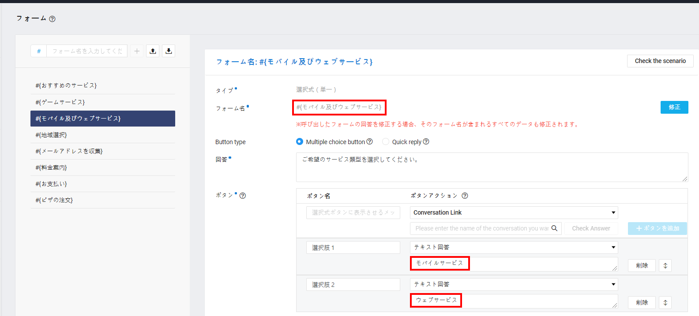
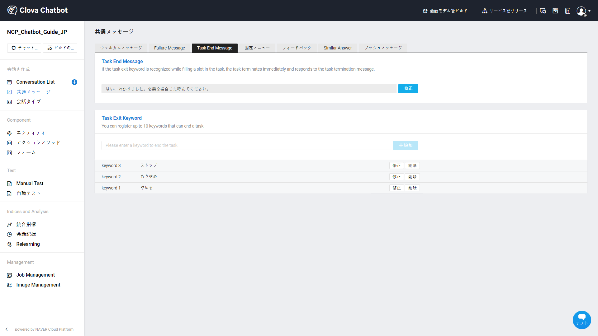
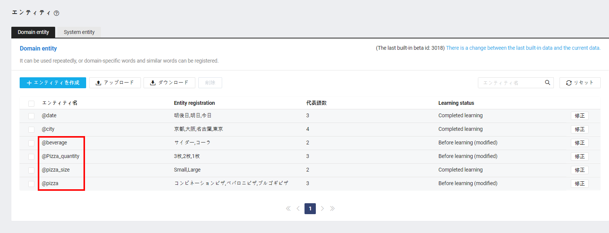
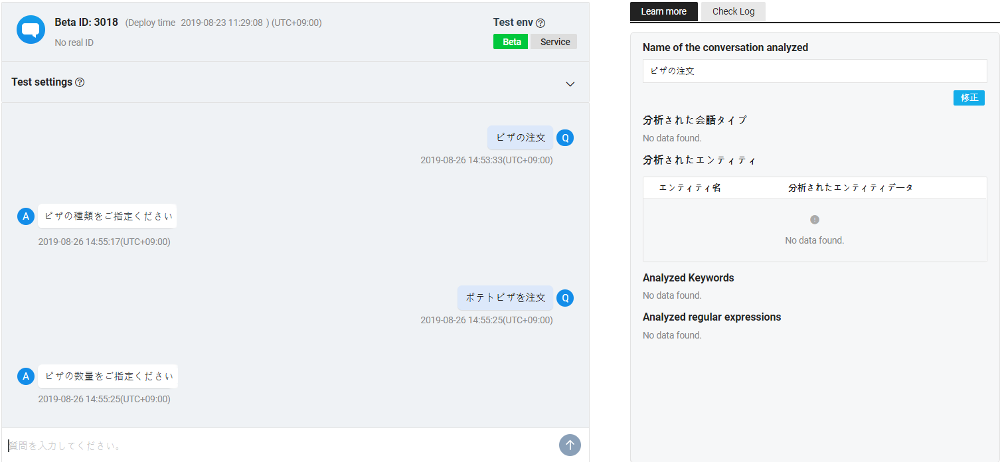
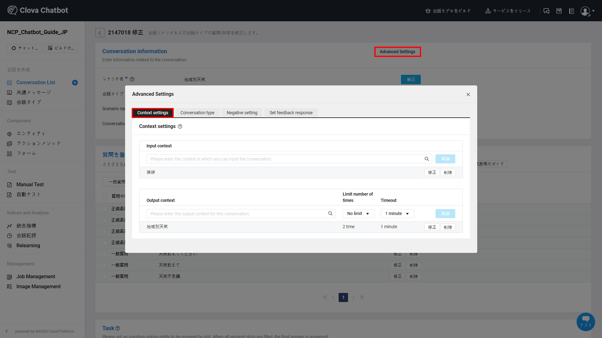

###チャットボットのAdvancedガイド


### 会話コンポーネント：フォーム + アクションメソッド

フォームは、ユーザーの入力を選択的に受け取ることができる方法です。

シナリオの例：今日の天気を教えて、という質問に `#{都市選択}`というフォームを提供するように設計しました。そしてソウルを選択すると、 `${weather}`というアクションメソッドを実行し、回答を出すシナリオです。


1. エンティティを作成します。

    「都市」というエンティティを入力します。代表語には「ソウル」と「ニューヨーク」を入力します。

    

2. アクションメソッドを作成します。

    ${weather}を作成します。

    呼び出すURLは、GET方式で `city = 都市名`を送信すると、現在の気温値を送ってくれるように開発されたと想定します。呼び出しURLから送る引数値に `city=$[都市]`を入力し、アクションメソッドを作成します。

    

    > **参考**
    >
    > アクションメソッドテストのために、簡単にServerless関数を1つ作りました。右側の「echo呼び出し」ボタンをクリックし、簡単にテストすることができます。
    > ```
    > https://beta-chatbot.ncloud.com/api/v1/actionmethod/echo?city=$[都市]
    > ```

3. フォームを作成します。

    フォーム `#{都市選択}`を作成します。
    ソウルを選択するかテキストでソウルと入力した場合、`${weather}` アクションメソッドが呼び出されます。

    

4. 会話を作成します。

    発話例の質問に「今日の天気教えて」と入力して回答には `#{都市選択}`を入力します。

    **学習**をクリックし、テストを完了します。


### 会話コンポーネント：フォーム＋フォーム、フォーム＋会話

チャットボットサービスではフォームを使用し、ユーザーの選択を制限しなくてもユーザーの自然な入力からサービス構成が可能です。しかし、決まったシナリオでユーザーの選択を導く必要がある場合は、フォームを連続してリンクしたりフォームから会話にリンクすることが可能です。

1. フォームとフォームをリンクする方法は以下のとおりです。

    

    - ボタンアクションは、テキスト回答を選択します。
    - テキスト入力欄に次にリンクするフォームを入力します。

    例えば `#{おすすめサービス}` フォームは、ボタンによって `#{ゲームサービス}` フォームや `#{モバイル及びウェブサービス}` フォームを呼び出すことができます。

2. フォームと会話をリンクする方法は以下のとおりです。

    

    - ボタンアクションは、Conversation Linkを選択します。
    - ボタンを選択するときにリンクする会話の名前を入力します。もし登録されていない会話名を入力したら、該当の名前で新規会話が作成されます。

    例えば、 `#{モバイル及びウェブサービス}` フォームはボタンによって `「モバイルサービス」会話`や  `「ウェブサービス」会話`を呼び出すことができます。


### スロット会話

チャットボットサービスのシナリオによって一般会話またはスロット会話を選択できます。もし、ピザの注文や宅配便の返品のように、ユーザーとのインタラクティブな会話からさまざまな情報を収集する必要があれば、スロット会話を活用することをお勧めします。

スロット会話が実行されると、スロットで指定されたエンティティ値をユーザーから受け取ります。必須スロット値がすべて埋め込まれると、最終回答が応答される構造です。


① **シナリオ名**を入力して会話を作成します。


② **Advanced Settings**の **Conversation type**タブから **スロット会話**を選択します。


④ **質問**を登録します。


登録された質問またはモデルが判断した類似質問が認識されると、スロット会話が実行されます。


⑤ **slot**情報を入力します。


チャットボットは、順番にスロットを埋めていきます。しかし、チャットボットが埋めるスロットの順番と関係なく、ユーザーは他の順番のスロットを応答したり、複数のスロットを応答してまとめて埋めることもできます。

- スロットの種類：チェックボックスをクリックし、必須スロットと選択スロットの設定を切り替えることができます。必須スロットを埋めなかった場合は、スロット会話は失敗し、最終回答を応答しません。一方、選択スロットは埋めなくてもスロット会話が失敗しません。
- Slot：スロットの名前を入力します。スロットの名前は該当スロット会話の中で重複されない値で入力します。
- Entity：スロットで受け取るエンティティを選択します。ドメインエンティティとシステムエンティティ両方とも活用可能で、他のスロットで使用されたエンティティを重複で選択できます。
- Value：ユーザーが埋めたスロットの値を最終回答またはAsk questionに取り込んで応答することができます。埋め込まれたスロットの値を使用するための表現式を入力してください。
- Ask question：スロットを埋めるためにAsk questionを入力してください。チャットボットは並んでいるスロットの順番にAsk questionを応答してスロットを埋めていきます。
- Other settings：スロットの詳細を設定できます。


- Option to Ask：スロットを埋めるためのOptionをQuick reply機能で表示できます。最大10のOptionを表示できます。
  - Select representative：エンティティ代表語リストを取り込んで活用します。
  - Text input：Optionを直接テキストで入力して活用します。
  - Existing query option：他のスロットのAsk questionを取り込んで活用します。


- Set number of times to ask : Ask questionを応答する回数を指定できます。
- Overcall count exceeded message：聞き返した回数が超過した場合、代わりに応答するメッセージを入力します。必須スロットの場合は、聞き返す回数が超過すると、スロットフィリングの失敗によって最終回答を応答しません。代わりに入力された **Overcall count exceeded message**を応答します。もし入力された **Overcall count exceeded message**がなければ、現在ユーザーの発話にマッチングした回答または失敗メッセージが応答されるようになります。


- value type：ユーザーが埋めたスロットの値を最終回答または聞き返す質問に取り込んで使用するときに、どの方式で使用するか選択できます。
  - Replacement value of representative：ユーザーが応答した値ではなく、代表語に置き換えた値を取り込んで使用します。代表語の置き換え値は、辞書型エンティティの場合のみ使用可能です。
  - User response value：ユーザーが応答した値をそのまま取り込んで使用します。
  - 例えば、 **@ピザのエンティティ**に、代表語 **「コンビネーションピザ」** - 類似語 **「コンビネーション」、「コンビピザ」**が登録されていたと想定できます。もし、 **Replacement value of representative**に設定したとしたら、ユーザーが「コンビピザ」と応答してピザスロットを埋めた場合、チャットボットは最終回答として **「コンビピザ」を注文しました。** の代わりに **「コンビネーションピザ」を注文しました。** と応答できます。
  - Default：Defaultは、必須スロットの場合のみ設定できます。ユーザーがが、必須スロットを埋めなかった場合にスロット会話を失敗せず、入力されたDefaultで代わりにスロットを埋めることができます。
  - 例えば、 **@ピザの枚数のエンティティ**にDefaultとして **"1枚"**が登録していると想定できます。もし、ユーザーがピザの枚数のスロットを埋めなかったら、Defaultである"1枚"でスロットが保存されます。


- keep slots in previous Conversations：スロットをすべて埋めた後コンテキストが維持されたら、チャットボットは埋め込まれたスロット情報を削除せずに覚えており、他のスロット会話に活用できます。
- コンテキストで続けられた会話に登録されたスロットのみ維持できます。そのため、維持したいスロットが登録されている会話がコンテキストで続けられるように構成する必要があります。


⑥ **Final answer registration**を登録します。


- 必須スロットがすべて埋め込まれると、チャットボットは最終回答を応答します。
- このとき、スロットの値表現式を活用してユーザーの発話を活用した回答を応答することができます。値を回答の入力欄にそのまま入力すると、ユーザーが埋めたスロットをそのまま取り込んでチャットボットが応答するようになります。
- もし、最終回答でアクションメソッドを呼び出すと、該当のスロット会話で埋め込まれたエンティティ値をまとめて送信するようになります。


⑦ **Slot Stop Message**を設定します。

スロット会話の途中、ユーザーが直ちに会話を中断したい状況になることがあります。しかし、ユーザーがスロットとは関係ない話をしても、チャットボットはスロットを埋めるために聞き返す質問を続けます。このような状況で、スロット停止キーワードとメッセージを活用し、ユーザーは強制的にスロット会話を止めることができます。



- Slot Stop Message
  - ユーザーがスロット会話の途中、スロット停止キーワードを入力した場合、直ちにスロット会話を中止して登録されたSlot Stop Messageを応答します。
- スロット停止キーワード
  - スロット停止キーワードは、スロット会話の中でのみ動作します。
  - 最大10件のキーワードを登録でき、exactで同じ質問が入力された場合のみ動作します。


#### **スロット会話を設計する：ピザの注文例**

1. エンティティを作成

    - ピザ、ピザのサイズ、ピザの枚数、飲み物のエンティティを作成します。

    

2. アクションメソッドを作成

    埋め込まれたスロット情報を入れて呼び出すアクションメソッドを作成します。

    

3. スロット会話を作成

   ① ピザの注文を意図する質問を入力します。

    

   ② 前のステップで作成したピザ、ピザのサイズ、ピザの枚数、飲み物のエンティティを活用してスロットを追加します。

    

    - ピザ、ピザのサイズ、ピザの枚数のエンティティは、必須スロットで指定します。
    - 飲み物のエンティティは、選択スロットで指定します。
    - 聞き返す質問や回数、聞き返す選択肢など、さまざまなスロット情報を意図しているチャットボットサービスに合わせて入力します。

   ③ 最終回答で選択式回答タイプを選択し、"はい"の選択肢の回答に `${ピザの注文}` アクションメソッドを呼び出すように指定します。

4. 学習を完了した後、完成したピザの注文スロットをテストします。

    


#### **スロット会話を設計する：天気機能の例（keep slots in previous Conversations）**

仮に、ユーザーが "**今日**の **ソウル** の天気教えて"と質問し、すべてのスロットを埋めてチャットボットの回答を聞いたと想定してみましょう。今度はユーザーが、 "**明日は?**" と聞いた場合、チャットボットが地域情報を聞き返すと、スマートなチャットボットという印象を与えにくいでしょう。そのため、以前のスロットで埋めた地域スロットを再び維持する必要があります。以下は、コンテキストを活用し、以前の会話のスロットを維持する会話の例です。

1. エンティティを作成

   - 日付、都市のエンティティを作成します。

   

2. アクションメソッドを作成

   埋め込まれたスロット情報を入れて呼び出すアクションメソッドを作成します。

   

3. スロット会話を作成

   ① スロット会話を作成した後、Output contextに `地域別天気`を入力します。

    

   ② 天気を確認する意図を持つ質問を入力します。
    
    

   ③ 前のステップで作成した天気、地域のエンティティを活用してスロットを追加します。

    - 日付、都市のエンティティを必須スロットに指定します。
    - 聞き返す質問と解す、聞き返す選択肢など、さまざまなスロット情報を意図しているチャットボットサービスに合わせて入力します。

   ④ 最終回答で天気アクションメソッドを呼び出すように指定します。  

    

4. 新しいスロット会話を作成

   ① 新しいスロット会話を作成した後、Input contextに `地域別天気`を入力します。

    

   ② "ソウルは?"、"ニューヨークは?"のように都市情報のみ盛り込んだ質問を入力します。

    

   ③ 前のステップで作成した日付、都市のエンティティを活用してスロットを追加します。

    - 日付、都市のエンティティを必須スロットに指定します。
    - 聞き返す質問と回数、聞き返す選択肢などさまざまなスロット情報を意図しているチャットボットサービスに合わせて入力します。

   ④ 日付スロットは、以前の会話のスロットを維持するように設定します。

    

   ⑤ 最終回答で天気のアクションメソッドを呼び出すように指定します。

    

5. 学習を完了した後、完成した天気スロットをテストします。

    


## 関連情報へのリンク

ドメインの作成、Conversation Listとコンポーネントの管理および統計管理に関しては以下の利用ガイドを参照してください。

- Chatbotスタートガイド
  - [チャットボットを開発する前に考えること](chatbot-1-2_ja.md)
  - [チャットボットのクイックスタートガイド](chatbot-1-1_ja.md)
  - [チャットボットのよくある質問](chatbot-1-3_ja.md)    
- Chatbotご利用ガイド
  - [ドメイン管理](chatbot-3-1_ja.md)
　- [Conversation Listの管理](chatbot-3-2_ja.md)  
  - [会話コンポーネントの管理](chatbot-3-3_ja.md)
  - [統計の管理](chatbot-3-4_ja.md)
  - [チャットボットのAdvancedガイド](chatbot-3-5_ja.md)
  - [正規表現の入力ガイド](chatbot-3-8_ja.md)
  - [チャットボットのCustom API Spec.](chatbot-3-7_ja.md)
- チャンネル連動ガイド
  - [LINE連動](chatbot-2-1_ja.md)
- Agent Connectionsガイド
  - [LINE Switcher API連動](chatbot-2-7_ja.md)