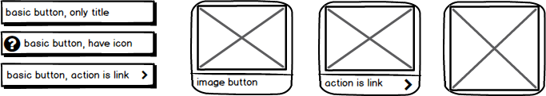
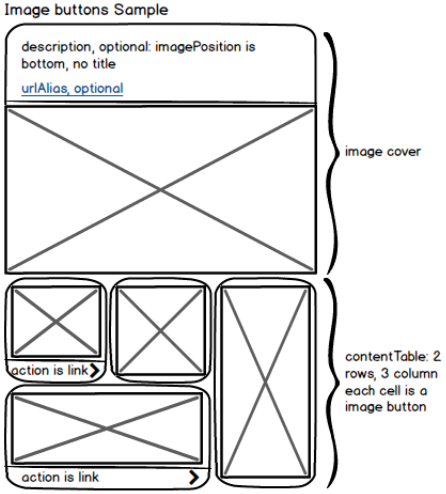
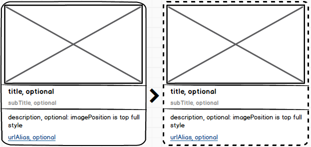
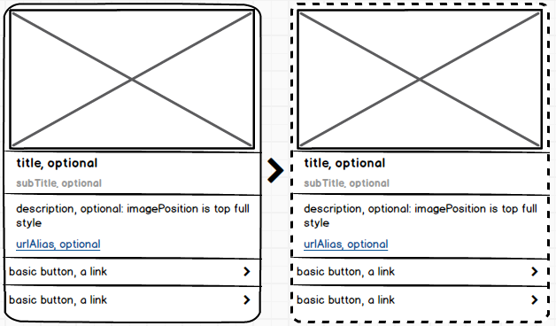

# チャットボットのCustom API Spec.

**Status: finished v2.5**

| version                | date       | update                                   |
| ---------------------- | ---------- | ---------------------------------------- |
| v2.5                     | 2019-04-22 | split flex to [Special Messenger Component](#special-messenger-component).<br>add [LineSticker](#line-sticker) and [LineWorksSticker](#lineworks-sticker).<br>modify [Action.Postback](#postback) define.<br>add keywords in success [response](#success). |
| [v2.4](chatbot-3-6-2.md)                   | 2019-03-12 | improve entities specification in [Response Status](#response-status). Attention: entities array model changes from v2.3. |
| v2.3                   | 2019-02-27 | add get Persistent Menu event add scenario, entities in success response. |
| v2.2                   | 2019-01-04 | support Flex Message(LINE)&[Persistent Menu. add persistent Menu in success response. add persistent menu examples. Template Component add background image, cover not required. add new action: Utterance. improve some descriptions. |
| v2.1                   | 2018-11-16 | add new action: Welcome, open event support one text bubble |
| [v2.0](chatbot-3-6-1.md) | 2018-11-07 | new structure, add signature             |
| [v1.2](chatbot-3-6.md) | 2018-08-08 | version 1.2                              |

## Table of Contents
- [Summary](#summary)
- [Request](#request)
  - [Request Event](#request-event)
    - [open](#open)
    - [send](#send)
    - [get persistent menu event](#getpersistentmenu)
  - [Signature Header](#signature-header)
- [Response](#response)
  - [Response Status](#response-status)
    - [success](#success)
    - [error](#error)

- [Component](#component)
  - [Basic Component](#basic-component)
    - [Text](#text)
    - [Image](#image)
    - [Button](#button)
  - [Composite Component](#composite-component)
    - [Template](#template)
    - [Carousel](#carousel)
  - [Special Messenger Component](#special-messenger-component)
    - [LineFlex](#line-flex)
    - [LineSticker](#line-sticker)
    - [LineWorksSticker](#lineworks-sticker)

- [Action](#action)
  - [Postback](#postback)
  - [Utterance](#utterance)
  - [Link](#link)
  - [Phone](#phone)
  - [Welcome](#welcome)

- [Quick Button](#quick-button)

- [Persistent Menu](#persistent-menu)

- [Response Examples](#response-examples)
  - [Text](#text-1)
    - [only normal text](#only-normal-text)
    - [full style with postback action](#full-style-with-postback-action)
  - [Image](#image-1)
    - [only image at the bottom with description](#only-image-at-the-bottom-with-description)
    - [full style image on the top with link action](#full-style-image-on-the-top-with-link-action)
  - [Template](#template-1)
    - [Text + Buttons](#text--buttons)
    - [Image + Buttons](#image--buttons)
    - [Image List](#image-list)
    - [MiniButtons](#minibuttons)
    - [ImageButtons](#imagebuttons)
  - [Carousel](#carousel-1)
    - [only images](#only-images)
    - [template with image + buttons](#template-with-image--buttons)
  - [Line Flex](#line-flex-1)
  - [Quick Buttons](#quick-buttons)
  - [Persistent Menu](#persistent-menu-1)
    - [text buttons](#text-buttons)
    - [image buttons use small icons](#image-buttons-use-small-icons)
    - [buttons use one background image](#buttons-use-one-background-image)

- [Error Define](#error-define)

## Request

- Custom Messenger -> Chatbot
- Http Method: POST
- Headers

| name                    | value                     |
| ----------------------- | ------------------------- |
| Content-Type            | "application/json;UTF-8"  |
| X-NCP-CHATBOT_SIGNATURE | signature of request body |

### Signature Header
- Signature
  - Algorithm: HmacSHA256
  - SecretKey: Copy from chatbot Custom config in "Messenger connection" page.
  - Sign content: Reqeust body.
- `X-NCP-CHATBOT_SIGNATURE`: Use Base64 encode signature bytes, and put base64 string in request header `X-NCP-CHATBOT_SIGNATURE`

### Request Event

#### open
- trigger when open messenger, will response welcome message if have set in "Messenger Connection" -> "Custom"
- Body Example

    ```
    {
      "version": "v2",
      "userId": "U47b00b58c90f8e47428af8b7bddcda3d",
      "userIp": "8.8.8.8",
      "timestamp": 12345678,
      "bubbles": [
        {
          "type": "text",
          "data" : {
            "description" : "postback text of welcome action"
          }
        }
      ],
      "event": "open"
    }
    ```
- Body Introduce

| Field     | Type   | Required | Description                              |
| --------- | ------ | -------- | ---------------------------------------- |
| version   | string | false    | 'v2', protocol version, if not set, default process as 'v1' |
| userId    | string | true     | unique id for user who chat with bot, no longer than 256 charactor. Please use different userId for different user to improve history |
| userIp    | string | false    | user ip address, not required            |
| timestamp | long   | true     | current milliseconds since January 1, 1970, 00:00:00 GMT |
| bubbles   | array  | true     | empty array "[]" or only one [Text](#text) component caused by [welcome action](#welcome) |
| event     | string | true     | fixed string value "open"                |

#### send
- send user chat message
- Body Example
    ```
    {
      "version": "v2",
      "userId": "U47b00b58c90f8e47428af8b7bddcda3d",
      "userIp": "8.8.8.8",
      "timestamp": 12345678,
      "bubbles": [
        {
          "type": "text",
          "data" : {
            "description" : "text content which is user input"
          }
        }
      ],
      "event": "send"
    }
    ```
- Body Introduce

| Field     | Type                 | Required | Description                              |
| --------- | -------------------- | -------- | ---------------------------------------- |
| version   | string               | false    | 'v2', protocol version, if not set, default process as 'v1' |
| userId    | string               | true     | unique id for user who chat with bot, no longer than 256 charactor. Please use different userId for different user to improve history |
| userIp    | string               | false    | user ip address, not required            |
| timestamp | long                 | true     | current milliseconds since January 1, 1970, 00:00:00 GMT |
| bubbles   | array[[Text](#text)] | true     | only support one [Text](#text) component, if there are more than one Text content, will use the last one as user request |
| event     | string               | true     | fixed string value "send"                |

*Back to [Table of Contents](#table-of-contents)*


#### getPersistentMenu
- if need show persistent menu but local cache not exists, could request [PersistentMenu](#persistent-menu), will response persistentMenu field if fixed menu have set in messengers custom tab.

- Body Example

    ```
    {
      "version": "v2",
      "userId": "U47b00b58c90f8e47428af8b7bddcda3d",
      "userIp": "8.8.8.8",
      "timestamp": 12345678,
      "bubbles": [],
      "event": "getPersistentMenu"
    }
    ```

- Body Introduce

| Field     | Type   | Required | Description                              |
| --------- | ------ | -------- | ---------------------------------------- |
| version   | string | false    | 'v2', protocol version, if not set, default process as 'v1' |
| userId    | string | true     | unique id for user who chat with bot, no longer than 256 charactor. Please use different userId for different user to improve history |
| userIp    | string | false    | user ip address, not required            |
| timestamp | long   | true     | current milliseconds since January 1, 1970, 00:00:00 GMT |
| bubbles   | array  | true     | empty array "[]"                         |
| event     | string | true     | fixed string value "getPersistentMenu"   |

*Back to [Table of Contents](#table-of-contents)*

## Response
- Chatbot -> Custom Messenger
- Headers

| name         | value                    |
| ------------ | ------------------------ |
| Content-Type | "application/json;UTF-8" |

### Response Status

#### Success
- Http Status Code: 200
- Body Example
    ```
    {
      "version": "v2",
      "userId": "U47b00b58c90f8e47428af8b7bddcda3d",
      "sessionId": "34a59946-5dcb-4b72-9b63-a773c659702e",
      "timestamp": 12345678,
      "bubbles": [
        // each component is a bubble
      ],
      "quickButtons": [
        // some buttons
      ],
      "scenario": {
        "name": "analyzedScenarioName",
        "intent": [
          // some scenario intent
        ]
      },
      "entities": [
        {
          "word": "userInputWord",
          "name": "analyzedEntityName"
        }
      ],
      "keywords": [
        {
          "keyword": "userInputKeyword",
          "group": "analyzedKeywordGroupName",
          "type": "analyzedKeywordType"
        }
      ],
      "persistentMenu": {
        // one template component
      },
      "event": "send"
    }
    ```
- Body Introduce

| Field          | Type                            | Must Exists | Description                              |
| -------------- | ------------------------------- | ----------- | ---------------------------------------- |
| version        | string                          | false       | 'v2', protocol version, if not set, default process as 'v1' |
| userId         | string                          | true        | same with [Request](#request) userId     |
| sessionId      | string                          | false       | current session id, managed by chatbot   |
| timestamp      | long                            | true        | response time milliseconds since January 1, 1970, 00:00:00 GMT |
| bubbles        | array[[Component](#component)]  | false       | array of any [Component](#component), each component is a bubble |
| quickButtons   | array[[Component](#component)]  | false       | array of [Basic Button](#button), show at the bottom of chat window |
| scenario       | jsonObject                      | false       | the analyzed result of user's chat matches scenario, contains scenario name and intent |
| entities       | array[jsonObject]               | false       | the words that match entities in user's chat |
| keywords       | array[jsonObject]               | false       | the words that match keyword in user's chat. Keyword have 2 types: "exactMatch" or "contain", "exactMatch" means user input full matches the keyword, "contain" means user input contains the keyword |
| persistentMenu | [Template Component](#template) | false       | set persistent menu, introduction reference [PersistentMenu](#persistent-menu) |
| event          | string                          | true        | fixed string value "send"                |


- **You can quick start with some [Response Examples](#response-examples).**

#### Error
- Http Status Code: 500
- Body Example
    ```
    {
      "code": "1001",
      "message": "domain code 'test' not found",
      "timestamp": 12345678
    }
    ```
- details introduce go to [Error Define](#error-define)

*Back to [Table of Contents](#table-of-contents)*


## Component
all component use same json structure
```
{
  "type": "...",
  "title": "optional, short bold text",
  "subTitle": "optional, short gray text",
  "data" : {
    ...
  }
}
```
- [Basic](#basic-component)
- [Composite](#composite-component)

### Basic Component
- [Text](#text)
- [Image](#image)
- [Button](#button)

#### Text


- Type: text
- Json Structure
    ```
    {
      "type": "text",
      "title": "optional, short bold text",
      "subTitle": "optional, short gray text",
      "data" : {
        "description" : "optional, a long text content",
        "url" : "optional, a hyperlink at the bottom of description",
        "urlAlias" : "optional, hyperlink show this alias",
        "action": {[Action Data](#action)}
      }
    }
    ```
- Introduce

| Field            | Type              | Must Exists | Description                          |
| ---------------- | ----------------- | ----------- | ------------------------------------ |
| type             | string            | true        | text                                 |
| title            | string            | false       | short bold text                      |
| subTitle         | string            | false       | short gray text                      |
| data.description | string            | false       | a long text content                  |
| data.url         | string            | false       | the hyperlink jump url               |
| data.urlAlias    | string            | false       | the hyperlink show text              |
| data.action      | [Action](#action) | false       | the action of click on text or title |

- **You can reference to some [Text Examples](#text-1).**

#### Image


- Type: image
- Json Structure
    ```
    {
      "type": "image",
      "title": "optional, short bold text",
      "subTitle": "optional, short gray text",
      "data" : {
        "imageUrl" : "https://ssl.pstatic.net/CloudFunctions.png",
        "alt" : "optional, short hint show when hover on image",
        "imagePosition" : "top",
        "description" : "optional, details info of image",
        "url" : "optional, a hyperlink at the bottom of description",
        "urlAlias" : "optional, hyperlink show this alias",
        "action": {[Action Data](#action)}
      }
    }
    ```
- Introduce

| Field              | Type              | Must Exists | Description                              |
| ------------------ | ----------------- | ----------- | ---------------------------------------- |
| type               | string            | true        | image                                    |
| title              | string            | false       | short bold text                          |
| subTitle           | string            | false       | short gray text                          |
| data.imageUrl      | string            | true        | image url, must be https url             |
| data.alt           | string            | false       | short hint text show hover on image      |
| data.imagePosition | string            | false       | top / bottom / left / right, default is top |
| data.description   | string            | false       | details info of image                    |
| data.url           | string            | false       | the hyperlink jump url                   |
| data.urlAlias      | string            | false       | the hyperlink show text                  |
| data.action        | [Action](#action) | false       | the action of click on image or title    |

- **You can reference to some [Image Examples](#image-1).**

#### Button


- Type: button
- Json Structure
  - basic button
    ```
    {
      "type": "button",
      "title": "optional, text show on button",
      "subTitle": "optional, short gray text",
      "data" : {
        "type": "basic",
        "iconUrl" : "https://ssl.pstatic.net/CloudFunctions.png",
        "action": {[Action Data](#action)}
      }
    }
    ```
  - image button
    ```
    {
      "type": "button",
      "title": "optional, text show on button",
      "subTitle": "optional, short gray text",
      "data" : {
        "type": "imageButton",
        "iconUrl" : "https://ssl.pstatic.net/CloudFunctions.png",
        "action": {[Action Data](#action)}
      }
    }
    ```
- Introduce

| Field        | Type              | Must Exists | Description                        |
| ------------ | ----------------- | ----------- | ---------------------------------- |
| type         | string            | true        | button                             |
| title        | string            | false       | text show on button                |
| subTitle     | string            | false       | short gray text                    |
| data.type    | string            | true        | basic or imageButton               |
| data.iconUrl | string            | false       | button icon url, must be https url |
| data.action  | [Action](#action) | true        | the action of click on button      |

*Back to [Table of Contents](#table-of-contents)*

### Composite Component

- [Template](#template)
- [Carousel](#carousel)

#### Template


Template is made up by basic components.
Template have three part: cover, contentTable, footTable. cover is the major content. contentTable, footTable are table layout.

- Type: template
- Json Structure
    ```
    {
      "type": "template",
      "title": "optional, short bold text",
      "subTitle": "optional, short gray text",
      "data":{
        "cover":{
          // any basic component
        },
        "contentTableShowRows": 3, // if row count more than 3, should be fold
        "contentBackgroundImage":"https://ssl.pstatic.net/CloudFunctions.png", // optinal
        "contentTable":[ // table layout
          [ // first row
            {
              "colSpan": 1,
              "rowSpan": 2,
              "data":{
                // any basic component type
              }
            },
            // other cells in first row
          ],
          // another rows
        ],
        "footTableShowRows":3, // if row count more than 3, should be fold
        "footBackgroundImage":"https://ssl.pstatic.net/CloudFunctions.png", // optinal
        "footTable":[
          // table layout same as contentTable
        ]
      }
    }
    ```
- Introduce

| Field                       | Type                                | Must Exists | Description                              |
| --------------------------- | ----------------------------------- | ----------- | ---------------------------------------- |
| type                        | string                              | true        | template                                 |
| title                       | string                              | false       | short bold text                          |
| subTitle                    | string                              | false       | short gray text                          |
| data.cover                  | [Basic Component](#basic-component) | false       | one Text / Image / Button                |
| data.contentTableShowRows   | integer                             | false       | show max rows, if row count more than max, should be fold, and plus an expand button. if not set, will show all rows |
| data.contentBackgroundImage | string                              | false       | show background image at the content table area |
| data.contentTable           | array[][Cell]                       | false       | table layout, two-dimensional array of cell, cell data is any basic component |
| data.footTableShowRows      | integer                             | false       | show max rows, if row count more than max, should be fold, and plus an expand button. if not set, will show all rows |
| data.footBackgroundImage    | string                              | false       | show background image at the foot table area |
| data.footTable              | array[][Cell]                       | false       | same as contentTable, always not exists, unless contentTable can't support |

- Introduce of cell in table layout

| Field   | Type                                | Must Exists | Description               |
| ------- | ----------------------------------- | ----------- | ------------------------- |
| rowSpan | integer                             | true        | span row count            |
| colSpan | integer                             | true        | span column count         |
| data    | [Basic Component](#basic-component) | true        | one Text / Image / Button |

- **You can reference to some [Template Examples](#template-1).**

#### Carousel


- Type: carousel
- Json Structure
    ```
    {
      "type": "carousel",
      "title": "optional, short bold text",
      "subTitle": "optional, short gray text",
      "data" : {
         "cards": [
           {
             // any component except carousel self and line flex
           },
           // more components
         ]
      }
    }
    ```
- Introduce

| Field      | Type                           | Must Exists | Description                              |
| ---------- | ------------------------------ | ----------- | ---------------------------------------- |
| type       | string                         | true        | carousel                                 |
| title      | string                         | false       | short bold text                          |
| subTitle   | string                         | false       | short gray text                          |
| data.cards | array[[Component](#component)] | true        | array of any component, but not carousel and line flex |

- **You can reference to some [Carousel Examples](#carousel-1).**

*Back to [Table of Contents](#table-of-contents)*


## Special Messenger Component

- [LineFlex](#line-flex)
- [LineSticker](#line-sticker)
- [LineWorksSticker](#lineworks-sticker)

### LINE Flex
To support [LINE Flex Message](https://developers.line.biz/en/reference/messaging-api/#flex-message) json.

- Type: flex
- Json Structure
    ```
    {
      "type": "flex",
      "title": "not used",
      "subTitle": "required, alternative text",
      "data" : {
        // LINE Flex Message container object
      }
    }
    ```
- Introduce

| Field    | Type                                     | Must Exists | Description                              |
| -------- | ---------------------------------------- | ----------- | ---------------------------------------- |
| type     | string                                   | true        | flex                                     |
| title    | string                                   | true        | alternative text, show in chat list and push alert |
| subTitle | string                                   | false       | not used                                 |
| data     | [FlexMessageContainerObject](https://developers.line.biz/en/reference/messaging-api/#container) | true        | Flex Message container object, could copy json from [Flex Message Simulator](https://developers.line.biz/console/fx/) |

- **You can reference to some [Line Flex Examples](#LINE-flex-1).**

### Line Sticker
To support [LINE Sitcker Message](https://developers.line.biz/en/reference/messaging-api/#sticker-message).

- Type: line_sticker
- Json Structure
    ```
    {
      "type": "line_sticker",
      "data" : {
         "packageId": "packageId of LINE",
         "stickerId": "stickerId of LINE"
      }
    }
    ```
- Introduce

| Field          | Type   | Must Exists | Description                              |
| -------------- | ------ | ----------- | ---------------------------------------- |
| type           | string | true        | line_sticker                             |
| data.packageId | string | true        | sticker's packageId of LINE， refer to [sticker list](https://developers.line.biz/media/messaging-api/sticker_list.pdf) |
| data.stickerId | string | true        | sticker's stickerId of LINE， refer to [sticker list](https://developers.line.biz/media/messaging-api/sticker_list.pdf) |

### LineWorks Sticker
To support [LINEWORKS Sitcker Message](https://developers.worksmobile.com/kr/document/100500806).

- Type: lineworks_sticker
- Json Structure
    ```
    {
      "type": "lineworks_sticker",
      "data" : {
         "packageId": "packageId of LINEWORKS",
         "stickerId": "stickerId of LINEWORKS"
      }
    }
    ```
- Introduce

| Field          | Type   | Must Exists | Description                              |
| -------------- | ------ | ----------- | ---------------------------------------- |
| type           | string | true        | lineworks_sticker                        |
| data.packageId | string | true        | sticker's packageId of LINEWORKS， refer to [sticker list](https://static.worksmobile.net/static/wm/media/message-bot-api/line_works_sticker_list_new.pdf) |
| data.stickerId | string | true        | sticker's stickerId of LINEWORKS， refer to [sticker list](https://static.worksmobile.net/static/wm/media/message-bot-api/line_works_sticker_list_new.pdf) |

*Back to [Table of Contents](#table-of-contents)*


## Action
Action is a common data for all basic components. define what will do when click on component.

- [Postback](#postback)
- [Utterance](#utterance)
- [Link](#link)
- [Phone](#phone)
- [Welcome](#welcome)

### Postback
When click on component, will postback the postbackText to chatbot and show postback as user chat.

- Type: postback
- Json Structure
    ```
    {
      "type": "postback",
      "data" : {
        "postback" : "text to show as user chat in messenger chat window"
        "postbackFull" : "full postback content send to chatbot"
      }
    }
    ```
- Introduce

| Field             | Type   | Must Exists | Description                              |
| ----------------- | ------ | ----------- | ---------------------------------------- |
| type              | string | true        | postback                                 |
| data.postback     | string | true        | text show as user chat, if send this field to chatbot, not affect previous features, but will not support some new features |
| data.postbackFull | string | true        | postback full content send to chatbot    |

## Utterance
When click on component, will postback a text to chatbot and show text as user chat.

- Type: utterance
- Json Structure
    ```
    {
      "type": "utterance",
      "data" : {
        "utteranceId" : 1,
        "text" : "text show in chat window",
        "postback" : "postback text"
      }
    }
    ```
- Introduce

| Field            | Type   | Must Exists | Description                            |
| ---------------- | ------ | ----------- | -------------------------------------- |
| type             | string | true        | utterance                              |
| data.utteranceId | string | true        |                                        |
| data.text        | string | true        | text show in chat window as user input |
| data.postback    | string | true        | postback text send to chatbot          |

### Link
When click on component, will jump to a url.

- Type: link
- Json Structure
    ```
    {
      "type": "link",
      "data" : {
        "url" : "http://www.ncloud.com",
        "mobileUrl" : "http://m.ncloud.com"
      }
    }
    ```
- Introduce

| Field          | Type   | Must Exists | Description           |
| -------------- | ------ | ----------- | --------------------- |
| type           | string | true        | postback              |
| data.url       | string | true        | open url              |
| data.mobileUrl | string | false       | url for mobile device |

### Phone
When click on component, will jump dial page. Maybe only support on mobile.

- Type: link
- Json Structure
    ```
    {
      "type": "phone",
      "data" : {
        "number" : "400-1111-1111",
        "name" : "Customer service"
      }
    }
    ```
- Introduce

| Field       | Type   | Must Exists | Description  |
| ----------- | ------ | ----------- | ------------ |
| type        | string | true        | phone        |
| data.number | string | true        | phone number |
| data.name   | string | false       | contact name |

*Back to [Table of Contents](#table-of-contents)*

### Welcome
When click on component, will send an [open event](#open event).

- Type: welcome
- Json Structure
    ```
    {
      "type": "welcome",
      "data" : {
        "postback" : "postback text, optional"
      }
    }
    ```
- Introduce

| Field         | Type   | Must Exists | Description                              |
| ------------- | ------ | ----------- | ---------------------------------------- |
| type          | string | true        | welcome                                  |
| data.postback | string | false       | postback text send to chatbot in open event |

*Back to [Table of Contents](#table-of-contents)*


## Quick Button
A group fixed buttons at the bottom of the chat window.

- **You can reference to some [Quick Buttons Examples](#quick-buttons).**


## Persistent Menu
The fixed menu, show when user touch menu button on chat bar. Always contains in welcome response. Not changes utils another response contains persistentMenu content.


Persistent menu is a [Template Component](https://oss.navercorp.com/chatbot/chatbot-ncp-api/wiki/chatbot-custom-api-specification-v2#template), with these definition:

- title will show on the chat bar.
- no cover, cover should be discard.
- no foot table, fields relate to foot area should be discard.
- contentBackgroundImage is the background, if the components in the contentTable have image, will cover the background.


## Response Examples

### Text

#### only normal text
```
{
  "version": "v2",
  "userId": "U47b00b58c90f8e47428af8b7bddcda3d",
  "sessionId": "34a59946-5dcb-4b72-9b63-a773c659702e",
  "timestamp": 12345678,
  "bubbles": [
    {
      "type": "text",
      "data" : {
        "description" : "description, optional: only description"
      }
    }
  ],
  "event": "send"
}
```

#### full style with postback action


```
{
  "version": "v2",
  "userId": "U47b00b58c90f8e47428af8b7bddcda3d",
  "sessionId": "34a59946-5dcb-4b72-9b63-a773c659702e",
  "timestamp": 12345678,
  "bubbles": [
    {
      "type": "text",
      "title": "title, optional",
      "subTitle": "subTitle, optional",
      "data" : {
        "description" : "description, optional: full style, optional",
        "url" : "http://www.ncloud.com",
        "urlAlias" : "urlAlias, optional",
        "action" : {
          "type": "postback",
          "data" : {
            "postback" : "Hello"
          }
        }
      }
    }
  ],
  "event": "send"
}
```

*Back to [Table of Contents](#table-of-contents)*

### Image

#### only image at the bottom, with description


```
{
  "version": "v2",
  "userId": "U47b00b58c90f8e47428af8b7bddcda3d",
  "sessionId": "34a59946-5dcb-4b72-9b63-a773c659702e",
  "timestamp": 12345678,
  "bubbles": [
    {
      "type": "image",
      "data" : {
        "imageUrl" : "https://ssl.pstatic.net/CloudFunctions.png",
        "imagePosition" : "bottom",
        "description" : "description, optional: imagePosition is bottom,only have description"
      }
    }
  ],
  "event": "send"
}
```

#### full style image on the top with link action


```
{
  "version": "v2",
  "userId": "U47b00b58c90f8e47428af8b7bddcda3d",
  "sessionId": "34a59946-5dcb-4b72-9b63-a773c659702e",
  "timestamp": 12345678,
  "bubbles": [
    {
      "type": "image",
      "title": "title, optional",
      "subTitle": "subTitle, optional",
      "data" : {
        "imageUrl" : "https://ssl.pstatic.net/CloudFunctions.png",
        "alt" : "alt, hover, optional",
        "description" : "description, optional: imagePosition is top, full style",
        "url" : "http://www.ncloud.com",
        "urlAlias" : "urlAlias, optional",
        "action" : {
          "type": "link",
          "data" : {
            "url" : "http://www.ncloud.com",
            "mobileUrl" : "http://m.ncloud.com"
          }
        }
      }
    }
  ],
  "event": "send"
}
```

*Back to [Table of Contents](#table-of-contents)*

### Template

#### Text + Buttons


```
{
  "version": "v2",
  "userId": "U47b00b58c90f8e47428af8b7bddcda3d",
  "sessionId": "34a59946-5dcb-4b72-9b63-a773c659702e",
  "timestamp": 12345678,
  "bubbles": [
    {
      "type": "template",
      "data" : {
        "cover": {
          "type" : "text",
          "title" : "title, optional",
          "subTitle" : "subTitle, optional",
          "data" : {
            "description" : "description, optional: text full style",
            "url" : "http://www.ncloud.com",
            "urlAlias" : "urlAlias, optional"
          }
        },
        "contentTable":[
          [
            {
              "colSpan" : 1,
              "rowSpan" : 1,
              "data" : {
                "type": "button",
                "title": "basic button, a link",
                "data" : {
                  "type": "basic",
                  "action": {
                    "type": "link",
                    "data" : {
                      "url" : "http://www.ncloud.com"
                    }
                  }
                }
              }
            }
          ],
          [
            {
              "colSpan" : 1,
              "rowSpan" : 1,
              "data" : {
                "type": "button",
                "title": "basic button, a link",
                "data" : {
                  "type": "basic",
                  "action": {
                    "type": "link",
                    "data" : {
                      "url" : "http://www.ncloud.com"
                    }
                  }
                }
              }
            }
          ]
        ]
      }
    }
  ],
  "event": "send"
}
```

*Back to [Table of Contents](#table-of-contents)*

#### Image + Buttons


```
{
  "version": "v2",
  "userId": "U47b00b58c90f8e47428af8b7bddcda3d",
  "sessionId": "34a59946-5dcb-4b72-9b63-a773c659702e",
  "timestamp": 12345678,
  "bubbles": [
    {
      "type": "template",
      "data" : {
        "cover": {
          "type": "image",
          "title": "title, optional",
          "subTitle": "subTitle, optional",
          "data" : {
            "imageUrl" : "https://ssl.pstatic.net/CloudFunctions.png",
            "alt" : "alt, hover, optional",
            "description" : "description, optional: imagePosition is top full style",
            "url" : "http://www.ncloud.com",
            "urlAlias" : "urlAlias, optional"
          }
        },
        "contentTable":[
          [
            {
              "colSpan" : 1,
              "rowSpan" : 1,
              "data" : {
                "type": "button",
                "title": "basic button, a link",
                "data" : {
                  "type": "basic",
                  "action": {
                    "type": "link",
                    "data" : {
                      "url" : "http://www.ncloud.com"
                    }
                  }
                }
              }
            }
          ],
          [
            {
              "colSpan" : 1,
              "rowSpan" : 1,
              "data" : {
                "type": "button",
                "title": "basic button, a link",
                "data" : {
                  "type": "basic",
                  "action": {
                    "type": "link",
                    "data" : {
                      "url" : "http://www.ncloud.com"
                    }
                  }
                }
              }
            }
          ]
        ]
      }
    }
  ],
  "event": "send"
}
```

*Back to [Table of Contents](#table-of-contents)*

#### Image List


```
{
  "version": "v2",
  "userId": "U47b00b58c90f8e47428af8b7bddcda3d",
  "sessionId": "34a59946-5dcb-4b72-9b63-a773c659702e",
  "timestamp": 12345678,
  "bubbles": [
    {
      "type": "template",
      "data" : {
        "cover": {
          "type": "text",
          "data" : {
            "description" : "description, optional: only text style"
          }
        },
        "contentTableShowRows" : 3,
        "contentTable":[
          [
            {
              "colSpan" : 1,
              "rowSpan" : 1,
              "data" : {
                "type": "image",
                "title": "title, optional",
                "subTitle": "subTitle, optional, no description",
                "data" : {
                  "imagePosition" : "left",
                  "imageUrl" : "https://ssl.pstatic.net/CloudFunctions.png",
                  "action": {
                    "type": "link",
                    "data" : {
                      "url" : "http://www.ncloud.com"
                    }
                  }
                }
              }
            }
          ],
          [
            {
              "colSpan" : 1,
              "rowSpan" : 1,
              "data" : {
                "type": "image",
                "title": "title, optional",
                "subTitle": "subTitle, optional, no description",
                "data" : {
                  "imagePosition" : "left",
                  "imageUrl" : "https://ssl.pstatic.net/CloudFunctions.png",
                  "action": {
                    "type": "link",
                    "data" : {
                      "url" : "http://www.ncloud.com"
                    }
                  }
                }
              }
            }
          ],
          [
            {
              "colSpan" : 1,
              "rowSpan" : 1,
              "data" : {
                "type": "image",
                "title": "title, optional",
                "subTitle": "subTitle, optional, no description",
                "data" : {
                  "imagePosition" : "left",
                  "imageUrl" : "https://ssl.pstatic.net/CloudFunctions.png",
                  "action": {
                    "type": "link",
                    "data" : {
                      "url" : "http://www.ncloud.com"
                    }
                  }
                }
              }
            }
          ],
          [
            {
              "colSpan" : 1,
              "rowSpan" : 1,
              "data" : {
                "type": "image",
                "title": "title, optional",
                "subTitle": "subTitle, optional, no description",
                "data" : {
                  "imagePosition" : "left",
                  "imageUrl" : "https://ssl.pstatic.net/CloudFunctions.png",
                  "action": {
                    "type": "link",
                    "data" : {
                      "url" : "http://www.ncloud.com"
                    }
                  }
                }
              }
            }
          ]
        ]
      }
    }
  ],
  "event": "send"
}
```

*Back to [Table of Contents](#table-of-contents)*

### MiniButtons


```
{
  "version": "v2",
  "userId": "U47b00b58c90f8e47428af8b7bddcda3d",
  "sessionId": "34a59946-5dcb-4b72-9b63-a773c659702e",
  "timestamp": 12345678,
  "bubbles": [
    {
      "type": "template",
      "data" : {
        "cover": {
          "type": "text",
          "title" : "title, optional",
          "subTitle" : "subTitle, optional",
          "data" : {
            "description" : "description, optional: text full style",
            "url" : "http://www.ncloud.com",
            "urlAlias" : "urlAlias, optional"
          }
        },
        "contentTable":[
          [
            {
              "colSpan" : 1,
              "rowSpan" : 1,
              "data" : {
                "type": "button",
                "title": "basic button, a link",
                "data" : {
                  "type": "basic",
                  "action": {
                    "type": "link",
                    "data" : {
                      "url" : "http://www.ncloud.com"
                    }
                  }
                }
              }
            },
            {
              "colSpan" : 1,
              "rowSpan" : 1,
              "data" : {
                "type": "button",
                "title": "basic button, a link",
                "data" : {
                  "type": "basic",
                  "action": {
                    "type": "link",
                    "data" : {
                      "url" : "http://www.ncloud.com"
                    }
                  }
                }
              }
            }
          ],
          [
            {
              "colSpan" : 1,
              "rowSpan" : 1,
              "data" : {
                "type": "button",
                "title": "basic button, a link",
                "data" : {
                  "type": "basic",
                  "action": {
                    "type": "link",
                    "data" : {
                      "url" : "http://www.ncloud.com"
                    }
                  }
                }
              }
            },
            {
              "colSpan" : 1,
              "rowSpan" : 1,
              "data" : {
                "type": "button",
                "title": "basic button, a link",
                "data" : {
                  "type": "basic",
                  "action": {
                    "type": "link",
                    "data" : {
                      "url" : "http://www.ncloud.com"
                    }
                  }
                }
              }
            }
          ],
          [
            {
              "colSpan" : 2,
              "rowSpan" : 1,
              "data" : {
                "type": "button",
                "title": "basic button, a link",
                "data" : {
                  "type": "basic",
                  "action": {
                    "type": "link",
                    "data" : {
                      "url" : "http://www.ncloud.com"
                    }
                  }
                }
              }
            }
          ]
        ]
      }
    }
  ],
  "event": "send"
}
```

*Back to [Table of Contents](#table-of-contents)*

#### ImageButtons



```
{
  "version": "v2",
  "userId": "U47b00b58c90f8e47428af8b7bddcda3d",
  "sessionId": "34a59946-5dcb-4b72-9b63-a773c659702e",
  "timestamp": 12345678,
  "bubbles": [
    {
      "type": "template",
      "data" : {
        "cover": {
          "type": "image",
          "data" : {
            "imageUrl" : "https://ssl.pstatic.net/CloudFunctions.png",
            "imagePosition" : "bottom",
            "description" : "description, optional: imagePosition is bottom, no title",
            "url" : "http://www.ncloud.com",
            "urlAlias" : "urlAlias, optional"
          }
        },
        "contentTable":[
          [
            {
              "colSpan" : 1,
              "rowSpan" : 1,
              "data" : {
                "type": "button",
                "title": "action is link",
                "data" : {
                  "type": "imageButton",
                  "iconUrl": "https://ssl.pstatic.net/CloudFunctions.png",
                  "action": {
                    "type": "link",
                    "data" : {
                      "url" : "http://www.ncloud.com"
                    }
                  }
                }
              }
            },
            {
              "colSpan" : 1,
              "rowSpan" : 1,
              "data" : {
                "type": "button",
                "data" : {
                  "type": "imageButton",
                  "iconUrl": "https://ssl.pstatic.net/CloudFunctions.png",
                  "action": {
                    "type": "link",
                    "data" : {
                      "url" : "http://www.ncloud.com"
                    }
                  }
                }
              }
            },
            {
              "colSpan" : 1,
              "rowSpan" : 2,
              "data" : {
                "type": "button",
                "data" : {
                  "type": "imageButton",
                  "iconUrl": "https://ssl.pstatic.net/CloudFunctions.png",
                  "action": {
                    "type": "link",
                    "data" : {
                      "url" : "http://www.ncloud.com"
                    }
                  }
                }
              }
            }
          ],
          [
            {
              "colSpan" : 2,
              "rowSpan" : 1,
              "data" : {
                "type": "button",
                "title": "action is link",
                "data" : {
                  "type": "imageButton",
                  "iconUrl": "https://ssl.pstatic.net/CloudFunctions.png",
                  "action": {
                    "type": "link",
                    "data" : {
                      "url" : "http://www.ncloud.com"
                    }
                  }
                }
              }
            }
          ]
        ]
      }
    }
  ],
  "event": "send"
}
```

*Back to [Table of Contents](#table-of-contents)*

### Carousel

#### only images



```
{
  "version": "v2",
  "userId": "U47b00b58c90f8e47428af8b7bddcda3d",
  "sessionId": "34a59946-5dcb-4b72-9b63-a773c659702e",
  "timestamp": 12345678,
  "bubbles": [
    {
      "type": "carousel",
      "data" : {
         "cards": [
            {
              "type": "image",
              "title": "title, optional",
              "subTitle": "subTitle, optional",
              "data" : {
                "imageUrl" : "https://ssl.pstatic.net/CloudFunctions.png",
                "description" : "description, optional: imagePosition is top full style",
                "url" : "http://www.ncloud.com",
                "urlAlias" : "urlAlias, optional"
              }
            },
            {
              "type": "image",
              "title": "title, optional",
              "subTitle": "subTitle, optional",
              "data" : {
                "imageUrl" : "https://ssl.pstatic.net/CloudFunctions.png",
                "description" : "description, optional: imagePosition is top full style",
                "url" : "http://www.ncloud.com",
                "urlAlias" : "urlAlias, optional"
              }
            }
         ]
      }
    }
  ],
  "event": "send"
}
```

#### template with image + buttons



```
{
  "version": "v2",
  "userId": "U47b00b58c90f8e47428af8b7bddcda3d",
  "sessionId": "34a59946-5dcb-4b72-9b63-a773c659702e",
  "timestamp": 12345678,
  "bubbles": [
    {
      "type": "carousel",
      "data" : {
         "cards": [
            {
              "type": "template",
              "data" : {
                "cover": {
                  "type": "image",
                  "title": "title, optional",
                  "subTitle": "subTitle, optional",
                  "data" : {
                    "imageUrl" : "https://ssl.pstatic.net/CloudFunctions.png",
                    "description" : "description, optional: imagePosition is top full style",
                    "url" : "http://www.ncloud.com",
                    "urlAlias" : "urlAlias, optional"
                  }
                },
                "contentTable":[
                  [
                    {
                      "colSpan" : 1,
                      "rowSpan" : 1,
                      "data" : {
                        "type": "button",
                        "title": "basic button, a link",
                        "data" : {
                          "type": "basic",
                          "action": {
                            "type": "link",
                            "data" : {
                              "url" : "http://www.ncloud.com"
                            }
                          }
                        }
                      }
                    }
                  ],
                  [
                    {
                      "colSpan" : 1,
                      "rowSpan" : 1,
                      "data" : {
                        "type": "button",
                        "title": "basic button, a link",
                        "data" : {
                          "type": "basic",
                          "action": {
                            "type": "link",
                            "data" : {
                              "url" : "http://www.ncloud.com"
                            }
                          }
                        }
                      }
                    }
                  ]
                ]
              }
            },
            {
              "type": "template",
              "data" : {
                "cover": {
                  "type": "image",
                  "title": "title, optional",
                  "subTitle": "subTitle, optional",
                  "data" : {
                    "imageUrl" : "https://ssl.pstatic.net/CloudFunctions.png",
                    "alt" : "alt, hover, optional",
                    "description" : "description, optional: imagePosition is top full style",
                    "url" : "http://www.ncloud.com",
                    "urlAlias" : "urlAlias, optional"
                  }
                },
                "contentTable":[
                  [
                    {
                      "colSpan" : 1,
                      "rowSpan" : 1,
                      "data" : {
                        "type": "button",
                        "title": "basic button, a link",
                        "data" : {
                          "type": "basic",
                          "action": {
                            "type": "link",
                            "data" : {
                              "url" : "http://www.ncloud.com"
                            }
                          }
                        }
                      }
                    }
                  ],
                  [
                    {
                      "colSpan" : 1,
                      "rowSpan" : 1,
                      "data" : {
                        "type": "button",
                        "title": "basic button, a link",
                        "data" : {
                          "type": "basic",
                          "action": {
                            "type": "link",
                            "data" : {
                              "url" : "http://www.ncloud.com"
                            }
                          }
                        }
                      }
                    }
                  ]
                ]
              }
            }
         ]
      }
    }
  ],
  "event": "send"
}
```

*Back to [Table of Contents](#table-of-contents)*

### LINE Flex


```
{
  "version": "v2",
  "userId": "U47b00b58c90f8e47428af8b7bddcda3d",
  "sessionId": "34a59946-5dcb-4b72-9b63-a773c659702e",
  "timestamp": 12345678,
  "bubbles": [
    {
      "type": "flex",
      "title": "this is a flex message",
      "data" : {
        "type": "bubble",
        "hero": {
          "type": "image",
          "url": "https://scdn.line-apps.com/n/channel_devcenter/img/fx/01_1_cafe.png",
          "size": "full",
          "aspectRatio": "20:13",
          "aspectMode": "cover"
        },
        "body": {
          "type": "box",
          "layout": "vertical",
          "contents": [
            {
              "type": "text",
              "text": "Brown Cafe",
              "weight": "bold",
              "size": "xl"
            }
          ]
        },
        "footer": {
          "type": "box",
          "layout": "vertical",
          "spacing": "sm",
          "contents": [
            {
              "type": "button",
              "style": "link",
              "height": "sm",
              "action": {
                "type": "uri",
                "label": "CALL",
                "uri": "https://linecorp.com"
              }
            },
            {
              "type": "spacer",
              "size": "sm"
            }
          ],
          "flex": 0
        }
      }
    }
  ],
  "event": "send"
}
```


### Quick Buttons


```
{
  "version": "v2",
  "userId": "U47b00b58c90f8e47428af8b7bddcda3d",
  "sessionId": "34a59946-5dcb-4b72-9b63-a773c659702e",
  "timestamp": 12345678,
  "quickButtons": [
    {
      "type": "button",
      "title": "no icon",
      "data" : {
        "type": "basic",
        "action": {
          "type": "postback",
          "data" : {
            "postback" : "hello"
          }
        }
      }
    },
    {
      "type": "button",
      "title": "phone",
      "data" : {
        "type": "basic",
        "iconUrl" : "https://ssl.pstatic.net/phone.png",
        "action": {
          "type": "phone",
          "data" : {
            "number" : "400-1111-1111"
          }
        }
      }
    },
    {
      "type": "button",
      "title": "pay",
      "data" : {
        "type": "basic",
        "iconUrl" : "https://ssl.pstatic.net/pay.png",
        "action": {
          "type": "link",
          "data" : {
            "url" : "http://www.ncloud.com"
          }
        }
      }
    }
  ],
  "event": "send"
}
```

*Back to [Table of Contents](#table-of-contents)*

## Persistent Menu

### text buttons


```
{
  "version": "v2",
  "userId": "U47b00b58c90f8e47428af8b7bddcda3d",
  "timestamp": 12345678,
  "persistentMenu": {
    "type": "template",
    "title": "Tap to hide the text menu",
    "data" : {
      "contentTable":[
        [
          {
            "colSpan" : 1,
            "rowSpan" : 1,
            "data" : {
              "type": "button",
              "title": "basic button, only title",
              "data" : {
                "type": "basic",
                "action": {
                  "type": "link",
                  "data" : {
                    "url" : "http://www.ncloud.com"
                  }
                }
              }
            }
          }
        ],
        [
          {
            "colSpan" : 1,
            "rowSpan" : 1,
            "data" : {
              "type": "button",
              "title": "basic button, only title",
              "data" : {
                "type": "basic",
                "action": {
                  "type": "link",
                  "data" : {
                    "url" : "http://www.ncloud.com"
                  }
                }
              }
            }
          }
        ],
        [
          {
            "colSpan" : 1,
            "rowSpan" : 1,
            "data" : {
              "type": "button",
              "title": "basic button, only title",
              "data" : {
                "type": "basic",
                "action": {
                  "type": "link",
                  "data" : {
                    "url" : "http://www.ncloud.com"
                  }
                }
              }
            }
          }
        ]
      ]
    }
  },
  "event": "send"
}
```

### image buttons use small icons


```
{
  "version": "v2",
  "userId": "U47b00b58c90f8e47428af8b7bddcda3d",
  "timestamp": 12345678,
  "persistentMenu": {
    "type": "template",
    "title": "Tap to hide the image menu",
    "data" : {
      "contentTable":[
        [
          {
            "colSpan" : 2,
            "rowSpan" : 2,
            "data" : {
              "type": "button",
              "title": "action is link",
              "data" : {
                "type": "imageButton",
                "iconUrl": "https://ssl.pstatic.net/CloudFunctions.png",
                "action": {
                  "type": "link",
                  "data" : {
                    "url" : "http://www.ncloud.com"
                  }
                }
              }
            }
          },
          {
            "colSpan" : 1,
            "rowSpan" : 1,
            "data" : {
              "type": "button",
              "data" : {
                "type": "imageButton",
                "iconUrl": "https://ssl.pstatic.net/CloudFunctions.png",
                "action": {
                  "type": "link",
                  "data" : {
                    "url" : "http://www.ncloud.com"
                  }
                }
              }
            }
          }
        ],
        [
          {
            "colSpan" : 1,
            "rowSpan" : 1,
            "data" : {
              "type": "button",
              "data" : {
                "type": "imageButton",
                "iconUrl": "https://ssl.pstatic.net/CloudFunctions.png",
                "action": {
                  "type": "link",
                  "data" : {
                    "url" : "http://www.ncloud.com"
                  }
                }
              }
            }
          }
        ]
      ]
    }
  },
  "event": "send"
}
```

### buttons use one background image


```
{
  "version": "v2",
  "userId": "U47b00b58c90f8e47428af8b7bddcda3d",
  "timestamp": 12345678,
  "persistentMenu": {
    "type": "template",
    "title": "Use one background image",
    "data" : {
      "contentTable":[
        [
          {
            "colSpan" : 1,
            "rowSpan" : 1,
            "data" : {
              "type": "button",
              "data" : {
                "type": "basic",
                "action": {
                  "type": "link",
                  "data" : {
                    "url" : "http://www.ncloud.com"
                  }
                }
              }
            }
          },
          {
            "colSpan" : 1,
            "rowSpan" : 1,
            "data" : {
              "type": "button",
              "data" : {
                "type": "basic",
                "action": {
                  "type": "link",
                  "data" : {
                    "url" : "http://www.ncloud.com"
                  }
                }
              }
            }
          }
        ],
        [
          {
            "colSpan" : 1,
            "rowSpan" : 1,
            "data" : {
              "type": "button",
              "data" : {
                "type": "basic",
                "action": {
                  "type": "link",
                  "data" : {
                    "url" : "http://www.ncloud.com"
                  }
                }
              }
            }
          },
          {
            "colSpan" : 1,
            "rowSpan" : 1,
            "data" : {
              "type": "button",
              "data" : {
                "type": "basic",
                "action": {
                  "type": "link",
                  "data" : {
                    "url" : "http://www.ncloud.com"
                  }
                }
              }
            }
          }
        ]
      ]
    }
  },
  "event": "send"
}
```

*Back to [Table of Contents](#table-of-contents)*


## Error Define

- Http Status Code: 500
- Body Example
    ```
    {
      "code": "1001",
      "message": "domain code test not found",
      "timestamp": 12345678
    }
    ```
- Body Introduce

| Field     | Type   | Must Exists | Description                              |
| --------- | ------ | ----------- | ---------------------------------------- |
| code      | string | true        | error code                               |
| event     | string | true        | fixed string value "send"                |
| timestamp | long   | true        | response time milliseconds since January 1, 1970, 00:00:00 GMT |

- Error Code Define

| code | Description                              |
| ---- | ---------------------------------------- |
| 4000 | request param invalid                    |
| 4010 | Unauthorized                             |
| 4030 | Forbidden to access                      |
| 4031 | Signature validate failed                |
| 4032 | timestamp exceeded time window(10000ms)  |
| 1000 | version not support                      |
| 1001 | Not found domain code                    |
| 1002 | check url param is invalid               |
| 5000 | Unknown service error                    |
| 5010 | Current protocol version not support this reply structure |
